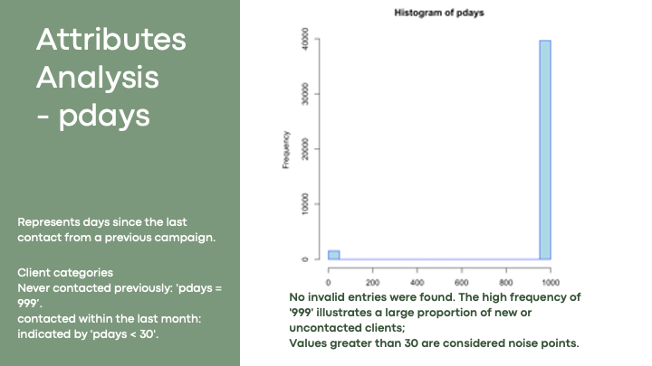
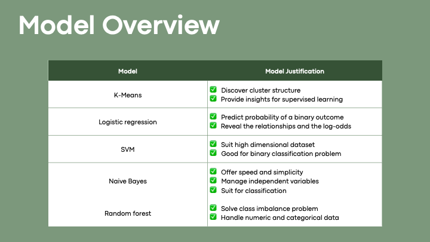
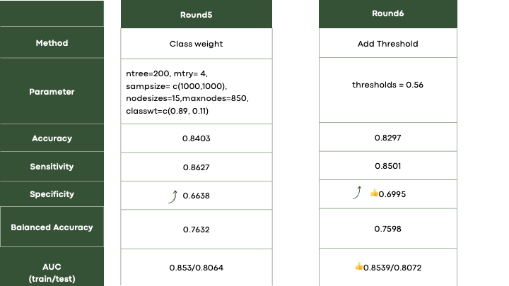
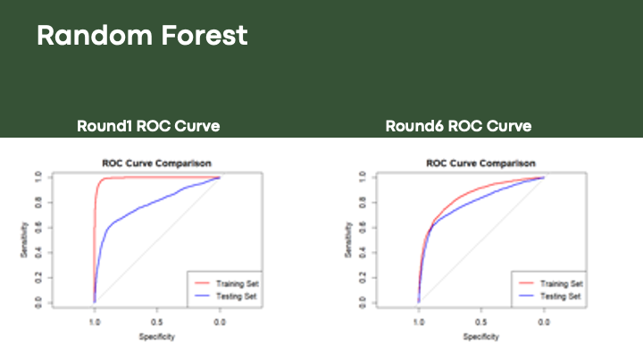

# Bank Marketing Dataset

## Overview

The **Bank Marketing** dataset contains data related to direct marketing campaigns of a Portuguese banking institution, where the campaigns were conducted via phone calls. The goal is to predict whether a client will subscribe to a bank term deposit based on various features.

## Files

1. **bank-additional-full.csv**: Contains 41,188 examples and 20 input features, ordered by date (May 2008 to November 2010).
2. **bank-additional.csv**: A smaller subset of the above dataset with 4,119 examples (10% of the full dataset), randomly selected. This dataset is useful for testing computationally demanding algorithms like SVM.

## Dataset Attributes

### Bank Client Data:

- `age`: Age (numeric)
- `job`: Type of job (categorical: "admin.", "blue-collar", "entrepreneur", etc.)
- `marital`: Marital status (categorical: "divorced", "married", "single", "unknown")
- `education`: Education level (categorical: "basic.4y", "high.school", etc.)
- `default`: Has credit in default? (categorical: "no", "yes", "unknown")
- `housing`: Has housing loan? (categorical: "no", "yes", "unknown")
- `loan`: Has personal loan? (categorical: "no", "yes", "unknown")

### Last Contact Information:

- `contact`: Type of communication (categorical: "cellular", "telephone")
- `month`: Last contact month (categorical: "jan", "feb", ..., "dec")
- `day_of_week`: Last contact day of the week (categorical: "mon", "tue", "wed", etc.)
- `duration`: Duration of the last contact in seconds (numeric)

### Other Attributes:

- `campaign`: Number of contacts performed during the current campaign (numeric)
- `pdays`: Number of days since the last contact from a previous campaign (numeric; 999 means no previous contact)
- `previous`: Number of contacts performed before this campaign (numeric)
- `poutcome`: Outcome of the previous marketing campaign (categorical: "failure", "nonexistent", "success")

### Social and Economic Context:

- `emp.var.rate`: Employment variation rate (numeric)
- `cons.price.idx`: Consumer price index (numeric)
- `cons.conf.idx`: Consumer confidence index (numeric)
- `euribor3m`: Euribor 3 month rate (numeric)
- `nr.employed`: Number of employees (numeric)

## Target Variable

- `y`: Whether the client subscribed to a term deposit (binary: "yes", "no")

## Missing Values

Some categorical attributes contain missing values, represented by the "unknown" label. These can be treated as a potential class or handled using imputation techniques.

## Report

## Citation

If you use this dataset in your research, please cite the following paper:

**[Moro et al., 2014]**  
S. Moro, P. Cortez, and P. Rita. "A Data-Driven Approach to Predict the Success of Bank Telemarketing." _Decision Support Systems_, In press.  
DOI: [10.1016/j.dss.2014.03.001](http://dx.doi.org/10.1016/j.dss.2014.03.001)

## Dataset Link

The dataset is publicly available at:  
[UCI Machine Learning Repository - Bank Marketing](https://archive.ics.uci.edu/ml/datasets/Bank+Marketing)
