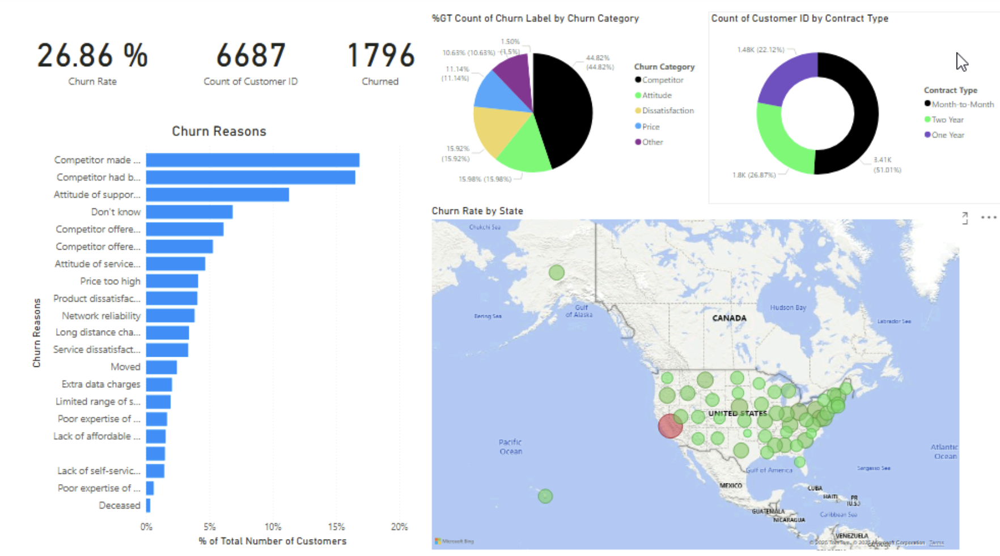

# Employee Churn Analysis

## Dataset Description

## Dashboard

## Key Insights

1. The primary reason for **employee churn** is **competitors**.
2. Employees with **month-to-month contracts** have the highest churn rate at **46.29%**.
3. **California** has the highest employee churn rate at **63.24%**.

## Recommendations

### 1. Competitive Retention Strategies

- Conduct a **competitive analysis** to understand why employees leave for competitors.
- Improve **compensation packages, career growth opportunities, and work-life balance**.
- Consider **stay interviews** to identify potential concerns before employees decide to leave.

### 2. Contract Type Optimization

- High churn among **month-to-month contracts** suggests instability.
- Offer **longer-term contracts** with better benefits (e.g., training programs, performance-based bonuses).
- Consider converting **high-performing temporary employees to permanent roles** to increase retention.

### 3. Regional Retention Initiatives (California)

- Investigate **state-specific factors** contributing to high churn (e.g., cost of living, industry competition, remote work options).
- Offer **location-based incentives**, such as housing support, remote work flexibility, or higher regional salaries.
- Strengthen **employee engagement and company culture** to improve loyalty in high-churn regions.
