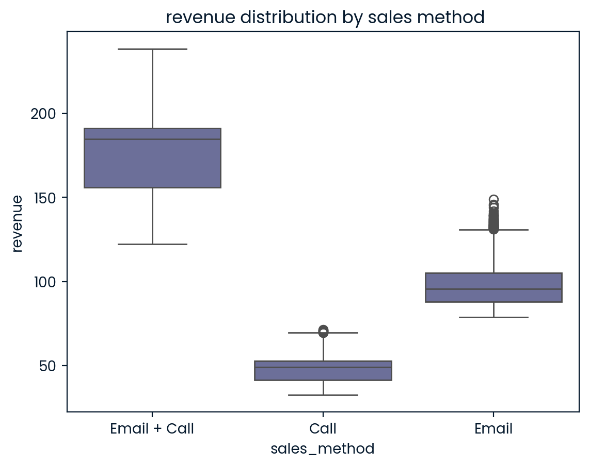

# 1. Data Loading

```python
import numpy as np
import pandas as pd
import matplotlib.pyplot as plt
import seaborn as sns
```

```python
df=pd.read_csv('product_sales.csv')
df.head()
```

<div>
<style scoped>
    .dataframe tbody tr th:only-of-type {
        vertical-align: middle;
    }

    .dataframe tbody tr th {
        vertical-align: top;
    }

    .dataframe thead th {
        text-align: right;
    }

</style>
<table border="1" class="dataframe">
  <thead>
    <tr style="text-align: right;">
      <th></th>
      <th>week</th>
      <th>sales_method</th>
      <th>customer_id</th>
      <th>nb_sold</th>
      <th>revenue</th>
      <th>years_as_customer</th>
      <th>nb_site_visits</th>
      <th>state</th>
    </tr>
  </thead>
  <tbody>
    <tr>
      <th>0</th>
      <td>2</td>
      <td>Email</td>
      <td>2e72d641-95ac-497b-bbf8-4861764a7097</td>
      <td>10</td>
      <td>NaN</td>
      <td>0</td>
      <td>24</td>
      <td>Arizona</td>
    </tr>
    <tr>
      <th>1</th>
      <td>6</td>
      <td>Email + Call</td>
      <td>3998a98d-70f5-44f7-942e-789bb8ad2fe7</td>
      <td>15</td>
      <td>225.47</td>
      <td>1</td>
      <td>28</td>
      <td>Kansas</td>
    </tr>
    <tr>
      <th>2</th>
      <td>5</td>
      <td>Call</td>
      <td>d1de9884-8059-4065-b10f-86eef57e4a44</td>
      <td>11</td>
      <td>52.55</td>
      <td>6</td>
      <td>26</td>
      <td>Wisconsin</td>
    </tr>
    <tr>
      <th>3</th>
      <td>4</td>
      <td>Email</td>
      <td>78aa75a4-ffeb-4817-b1d0-2f030783c5d7</td>
      <td>11</td>
      <td>NaN</td>
      <td>3</td>
      <td>25</td>
      <td>Indiana</td>
    </tr>
    <tr>
      <th>4</th>
      <td>3</td>
      <td>Email</td>
      <td>10e6d446-10a5-42e5-8210-1b5438f70922</td>
      <td>9</td>
      <td>90.49</td>
      <td>0</td>
      <td>28</td>
      <td>Illinois</td>
    </tr>
  </tbody>
</table>
</div>

# 2. Data Validation

## 2.1 explore data size

```python
print(f'{df.shape[0]} rows, {df.shape[1]} columns')
```

    15000 rows, 8 columns

## 2.2 remove duplicates

```python
df[df.duplicated()]
```

<div>
<style scoped>
    .dataframe tbody tr th:only-of-type {
        vertical-align: middle;
    }

    .dataframe tbody tr th {
        vertical-align: top;
    }

    .dataframe thead th {
        text-align: right;
    }

</style>
<table border="1" class="dataframe">
  <thead>
    <tr style="text-align: right;">
      <th></th>
      <th>week</th>
      <th>sales_method</th>
      <th>customer_id</th>
      <th>nb_sold</th>
      <th>revenue</th>
      <th>years_as_customer</th>
      <th>nb_site_visits</th>
      <th>state</th>
    </tr>
  </thead>
  <tbody>
  </tbody>
</table>
</div>

there is no duplicates

## 2.3 handle missing values

```python
df.replace(['NA','NULL'],np.nan,inplace=True,regex=True)
df.isnull().any()
```

    week                 False
    sales_method         False
    customer_id          False
    nb_sold              False
    revenue               True
    years_as_customer    False
    nb_site_visits       False
    state                False
    dtype: bool

```python
# the number of missing values
df[df['revenue'].isnull()].shape[0]
```

    1074

since only 1074 missing values in revenue, we will remove them

```python
df=df[df['revenue'].notnull()]
```

## 2.4 validate datatype

```python
df.info()
```

    <class 'pandas.core.frame.DataFrame'>
    Int64Index: 13926 entries, 1 to 14998
    Data columns (total 8 columns):
     #   Column             Non-Null Count  Dtype
    ---  ------             --------------  -----
     0   week               13926 non-null  int64
     1   sales_method       13926 non-null  object
     2   customer_id        13926 non-null  object
     3   nb_sold            13926 non-null  int64
     4   revenue            13926 non-null  float64
     5   years_as_customer  13926 non-null  int64
     6   nb_site_visits     13926 non-null  int64
     7   state              13926 non-null  object
    dtypes: float64(1), int64(4), object(3)
    memory usage: 979.2+ KB

all the column datatype are displayed as decribed, there is no need for datatype transformation.

## 2.5 validate data consistency

```python
df['sales_method'].value_counts()
```

    Email           6915
    Call            4781
    Email + Call    2203
    em + call         20
    email              7
    Name: sales_method, dtype: int64

standardize data format of the sales_method column

```python
df.replace('email','Email',inplace=True)
df.replace('em + call','Email + Call',inplace=True)
df['sales_method'].value_counts()
```

    Email           6922
    Call            4781
    Email + Call    2223
    Name: sales_method, dtype: int64

```python
df['state'].value_counts()
```

    California        1739
    Texas             1109
    New York           899
    Florida            826
    Illinois           576
    Pennsylvania       553
    Ohio               520
    Michigan           466
    Georgia            460
    North Carolina     430
    New Jersey         402
    Virginia           346
    Indiana            327
    Washington         309
    Tennessee          308
    Arizona            295
    Missouri           286
    Massachusetts      270
    Maryland           245
    Wisconsin          235
    Minnesota          228
    Oregon             214
    Louisiana          213
    South Carolina     213
    Colorado           212
    Alabama            202
    Kentucky           202
    Oklahoma           184
    Connecticut        167
    Iowa               154
    Mississippi        133
    Kansas             129
    Arkansas           118
    Utah               115
    Nevada              97
    Nebraska            86
    New Mexico          79
    West Virginia       77
    Hawaii              67
    Maine               60
    Idaho               59
    New Hampshire       48
    Montana             43
    Rhode Island        41
    South Dakota        38
    Alaska              35
    Wyoming             32
    Vermont             27
    Delaware            27
    North Dakota        25
    Name: state, dtype: int64

no need to change

## 2.5 handle outliers

```python
df.describe()
```

<div>
<style scoped>
    .dataframe tbody tr th:only-of-type {
        vertical-align: middle;
    }

    .dataframe tbody tr th {
        vertical-align: top;
    }

    .dataframe thead th {
        text-align: right;
    }

</style>
<table border="1" class="dataframe">
  <thead>
    <tr style="text-align: right;">
      <th></th>
      <th>week</th>
      <th>nb_sold</th>
      <th>revenue</th>
      <th>years_as_customer</th>
      <th>nb_site_visits</th>
    </tr>
  </thead>
  <tbody>
    <tr>
      <th>count</th>
      <td>13926.000000</td>
      <td>13926.000000</td>
      <td>13926.000000</td>
      <td>13926.000000</td>
      <td>13926.000000</td>
    </tr>
    <tr>
      <th>mean</th>
      <td>3.078271</td>
      <td>10.040069</td>
      <td>93.934943</td>
      <td>4.978960</td>
      <td>24.947006</td>
    </tr>
    <tr>
      <th>std</th>
      <td>1.650650</td>
      <td>1.789690</td>
      <td>47.435312</td>
      <td>5.047828</td>
      <td>3.491491</td>
    </tr>
    <tr>
      <th>min</th>
      <td>1.000000</td>
      <td>7.000000</td>
      <td>32.540000</td>
      <td>0.000000</td>
      <td>12.000000</td>
    </tr>
    <tr>
      <th>25%</th>
      <td>1.000000</td>
      <td>9.000000</td>
      <td>52.470000</td>
      <td>1.000000</td>
      <td>23.000000</td>
    </tr>
    <tr>
      <th>50%</th>
      <td>3.000000</td>
      <td>10.000000</td>
      <td>89.500000</td>
      <td>3.000000</td>
      <td>25.000000</td>
    </tr>
    <tr>
      <th>75%</th>
      <td>4.000000</td>
      <td>11.000000</td>
      <td>107.327500</td>
      <td>7.000000</td>
      <td>27.000000</td>
    </tr>
    <tr>
      <th>max</th>
      <td>6.000000</td>
      <td>16.000000</td>
      <td>238.320000</td>
      <td>63.000000</td>
      <td>37.000000</td>
    </tr>
  </tbody>
</table>
</div>

```python
sns.boxplot(data=df,x='week')
plt.figure.figsize=(8,6)
plt.title('box plot for week')
plt.show()
```


**week**: the new prodcut line launched 6 weeks ago, there is no outliers in this column

```python
sns.boxplot(data=df,x='nb_sold')
plt.figure.figsize=(8,6)
plt.title('box plot for nb_sold')
plt.show()
```


```python
df[df['nb_sold']>15]
```

<div>
<style scoped>
    .dataframe tbody tr th:only-of-type {
        vertical-align: middle;
    }

    .dataframe tbody tr th {
        vertical-align: top;
    }

    .dataframe thead th {
        text-align: right;
    }

</style>
<table border="1" class="dataframe">
  <thead>
    <tr style="text-align: right;">
      <th></th>
      <th>week</th>
      <th>sales_method</th>
      <th>customer_id</th>
      <th>nb_sold</th>
      <th>revenue</th>
      <th>years_as_customer</th>
      <th>nb_site_visits</th>
      <th>state</th>
    </tr>
  </thead>
  <tbody>
    <tr>
      <th>213</th>
      <td>6</td>
      <td>Email + Call</td>
      <td>00dc7276-7b92-4642-9d24-69c841286964</td>
      <td>16</td>
      <td>232.86</td>
      <td>1</td>
      <td>33</td>
      <td>Michigan</td>
    </tr>
    <tr>
      <th>575</th>
      <td>6</td>
      <td>Email + Call</td>
      <td>a0b8123a-0f92-4152-8ea0-cc732e452f49</td>
      <td>16</td>
      <td>234.03</td>
      <td>6</td>
      <td>29</td>
      <td>California</td>
    </tr>
    <tr>
      <th>735</th>
      <td>6</td>
      <td>Email + Call</td>
      <td>0002aed1-1a1f-4b20-845f-7a4b8cc9977a</td>
      <td>16</td>
      <td>237.19</td>
      <td>2</td>
      <td>29</td>
      <td>California</td>
    </tr>
    <tr>
      <th>1288</th>
      <td>6</td>
      <td>Email + Call</td>
      <td>a42b682d-573a-4301-82b1-42caa5dccc46</td>
      <td>16</td>
      <td>232.73</td>
      <td>4</td>
      <td>30</td>
      <td>Georgia</td>
    </tr>
    <tr>
      <th>1426</th>
      <td>6</td>
      <td>Email + Call</td>
      <td>fce8075a-23bc-45ff-b537-793a2ddd99c0</td>
      <td>16</td>
      <td>234.08</td>
      <td>0</td>
      <td>30</td>
      <td>New York</td>
    </tr>
    <tr>
      <th>1684</th>
      <td>6</td>
      <td>Email + Call</td>
      <td>c1c73fb9-cf35-47e2-94d0-eec90bcada4d</td>
      <td>16</td>
      <td>233.80</td>
      <td>0</td>
      <td>30</td>
      <td>Florida</td>
    </tr>
    <tr>
      <th>1743</th>
      <td>6</td>
      <td>Email + Call</td>
      <td>7fc56abe-dbf1-418a-988c-08e33ebe30bd</td>
      <td>16</td>
      <td>233.39</td>
      <td>1</td>
      <td>32</td>
      <td>Oregon</td>
    </tr>
    <tr>
      <th>1760</th>
      <td>6</td>
      <td>Email + Call</td>
      <td>4aba322a-0532-4925-b7ae-c51d9dc359ef</td>
      <td>16</td>
      <td>232.89</td>
      <td>3</td>
      <td>36</td>
      <td>Florida</td>
    </tr>
    <tr>
      <th>2487</th>
      <td>6</td>
      <td>Email + Call</td>
      <td>5bc155b2-a053-472c-a8e1-9a6caf1f584b</td>
      <td>16</td>
      <td>232.97</td>
      <td>0</td>
      <td>29</td>
      <td>California</td>
    </tr>
    <tr>
      <th>2661</th>
      <td>6</td>
      <td>Email + Call</td>
      <td>efd9156a-f466-4a5c-9e28-5960fb69b36c</td>
      <td>16</td>
      <td>233.32</td>
      <td>13</td>
      <td>28</td>
      <td>Louisiana</td>
    </tr>
    <tr>
      <th>3490</th>
      <td>6</td>
      <td>Email + Call</td>
      <td>21513a8f-f7aa-4ff7-b212-b213117c5a07</td>
      <td>16</td>
      <td>238.32</td>
      <td>0</td>
      <td>36</td>
      <td>North Carolina</td>
    </tr>
    <tr>
      <th>4238</th>
      <td>6</td>
      <td>Email + Call</td>
      <td>68c72896-b99a-44e8-89ac-061ef612f20e</td>
      <td>16</td>
      <td>235.59</td>
      <td>6</td>
      <td>32</td>
      <td>North Carolina</td>
    </tr>
    <tr>
      <th>4374</th>
      <td>6</td>
      <td>Email + Call</td>
      <td>80644239-745b-41e7-883a-21350495db46</td>
      <td>16</td>
      <td>232.83</td>
      <td>2</td>
      <td>32</td>
      <td>Texas</td>
    </tr>
    <tr>
      <th>4638</th>
      <td>6</td>
      <td>Email + Call</td>
      <td>0f350fa1-f6a9-488b-9fe1-256b66083882</td>
      <td>16</td>
      <td>232.52</td>
      <td>5</td>
      <td>26</td>
      <td>Maryland</td>
    </tr>
    <tr>
      <th>4719</th>
      <td>6</td>
      <td>Email + Call</td>
      <td>a58667ad-d27c-480f-b000-1865ed1cb412</td>
      <td>16</td>
      <td>233.97</td>
      <td>4</td>
      <td>33</td>
      <td>California</td>
    </tr>
    <tr>
      <th>5591</th>
      <td>6</td>
      <td>Email + Call</td>
      <td>aafa1bb4-aea8-45c7-9704-9d732d8bcb6f</td>
      <td>16</td>
      <td>232.79</td>
      <td>2</td>
      <td>32</td>
      <td>New Jersey</td>
    </tr>
    <tr>
      <th>6723</th>
      <td>6</td>
      <td>Email + Call</td>
      <td>e4982d88-95c8-4316-bf5d-841229f5822e</td>
      <td>16</td>
      <td>233.05</td>
      <td>2</td>
      <td>30</td>
      <td>Wisconsin</td>
    </tr>
    <tr>
      <th>6739</th>
      <td>6</td>
      <td>Email + Call</td>
      <td>86521b15-4742-4f01-8ba3-ea7d172fe494</td>
      <td>16</td>
      <td>235.58</td>
      <td>1</td>
      <td>28</td>
      <td>Pennsylvania</td>
    </tr>
    <tr>
      <th>6792</th>
      <td>6</td>
      <td>Email + Call</td>
      <td>535ddeb0-ca5d-40f2-a0e0-733c864fe686</td>
      <td>16</td>
      <td>236.75</td>
      <td>2</td>
      <td>30</td>
      <td>Florida</td>
    </tr>
    <tr>
      <th>7336</th>
      <td>6</td>
      <td>Email + Call</td>
      <td>53e4d803-2c9f-43b7-a970-a996b33d4619</td>
      <td>16</td>
      <td>234.44</td>
      <td>1</td>
      <td>30</td>
      <td>New York</td>
    </tr>
    <tr>
      <th>8423</th>
      <td>6</td>
      <td>Email + Call</td>
      <td>0fd53854-68c9-49cb-a0d1-50f077860358</td>
      <td>16</td>
      <td>233.03</td>
      <td>3</td>
      <td>29</td>
      <td>Connecticut</td>
    </tr>
    <tr>
      <th>8943</th>
      <td>6</td>
      <td>Email + Call</td>
      <td>96a6fd63-5ddd-4877-b2d5-038ac4fea19f</td>
      <td>16</td>
      <td>233.09</td>
      <td>0</td>
      <td>27</td>
      <td>Utah</td>
    </tr>
    <tr>
      <th>9445</th>
      <td>6</td>
      <td>Email + Call</td>
      <td>1d23bed9-8e72-40f1-946e-760e8b19be71</td>
      <td>16</td>
      <td>233.37</td>
      <td>1</td>
      <td>30</td>
      <td>West Virginia</td>
    </tr>
    <tr>
      <th>11258</th>
      <td>6</td>
      <td>Email + Call</td>
      <td>77dce5a0-cf65-488d-8d3a-500a1f861c27</td>
      <td>16</td>
      <td>232.55</td>
      <td>3</td>
      <td>34</td>
      <td>Hawaii</td>
    </tr>
    <tr>
      <th>12006</th>
      <td>6</td>
      <td>Email + Call</td>
      <td>5a34f271-29fd-4777-a9d6-ffd5076f4f55</td>
      <td>16</td>
      <td>238.23</td>
      <td>3</td>
      <td>33</td>
      <td>New York</td>
    </tr>
    <tr>
      <th>12659</th>
      <td>6</td>
      <td>Email + Call</td>
      <td>35b1f346-b0ed-4ab8-976e-504942488c9c</td>
      <td>16</td>
      <td>234.98</td>
      <td>3</td>
      <td>29</td>
      <td>Hawaii</td>
    </tr>
    <tr>
      <th>13388</th>
      <td>6</td>
      <td>Email + Call</td>
      <td>1723838d-ea53-4477-93d2-61fecb7d750f</td>
      <td>16</td>
      <td>235.40</td>
      <td>2</td>
      <td>29</td>
      <td>South Dakota</td>
    </tr>
    <tr>
      <th>13434</th>
      <td>6</td>
      <td>Email + Call</td>
      <td>6d4f9376-80e3-4da3-96b3-708564427fe9</td>
      <td>16</td>
      <td>232.68</td>
      <td>5</td>
      <td>32</td>
      <td>New York</td>
    </tr>
    <tr>
      <th>13645</th>
      <td>6</td>
      <td>Email + Call</td>
      <td>47fa33be-e4c7-491c-a42c-2bc653c28433</td>
      <td>16</td>
      <td>233.77</td>
      <td>5</td>
      <td>35</td>
      <td>Ohio</td>
    </tr>
    <tr>
      <th>13756</th>
      <td>6</td>
      <td>Email + Call</td>
      <td>6714db9b-2567-4062-9ea7-83006e303b2a</td>
      <td>16</td>
      <td>234.10</td>
      <td>1</td>
      <td>28</td>
      <td>New Jersey</td>
    </tr>
  </tbody>
</table>
</div>

**nb_sold**: after analysis the outliers are resonable sales, so keep them

```python
sns.boxplot(data=df,x='revenue')
plt.figure.figsize=(8,6)
plt.title('box plot for revenue')
plt.show()
```


```python
df[df['revenue']>180].sort_values('revenue',ascending=False)
```

<div>
<style scoped>
    .dataframe tbody tr th:only-of-type {
        vertical-align: middle;
    }

    .dataframe tbody tr th {
        vertical-align: top;
    }

    .dataframe thead th {
        text-align: right;
    }

</style>
<table border="1" class="dataframe">
  <thead>
    <tr style="text-align: right;">
      <th></th>
      <th>week</th>
      <th>sales_method</th>
      <th>customer_id</th>
      <th>nb_sold</th>
      <th>revenue</th>
      <th>years_as_customer</th>
      <th>nb_site_visits</th>
      <th>state</th>
    </tr>
  </thead>
  <tbody>
    <tr>
      <th>3490</th>
      <td>6</td>
      <td>Email + Call</td>
      <td>21513a8f-f7aa-4ff7-b212-b213117c5a07</td>
      <td>16</td>
      <td>238.32</td>
      <td>0</td>
      <td>36</td>
      <td>North Carolina</td>
    </tr>
    <tr>
      <th>12006</th>
      <td>6</td>
      <td>Email + Call</td>
      <td>5a34f271-29fd-4777-a9d6-ffd5076f4f55</td>
      <td>16</td>
      <td>238.23</td>
      <td>3</td>
      <td>33</td>
      <td>New York</td>
    </tr>
    <tr>
      <th>735</th>
      <td>6</td>
      <td>Email + Call</td>
      <td>0002aed1-1a1f-4b20-845f-7a4b8cc9977a</td>
      <td>16</td>
      <td>237.19</td>
      <td>2</td>
      <td>29</td>
      <td>California</td>
    </tr>
    <tr>
      <th>6792</th>
      <td>6</td>
      <td>Email + Call</td>
      <td>535ddeb0-ca5d-40f2-a0e0-733c864fe686</td>
      <td>16</td>
      <td>236.75</td>
      <td>2</td>
      <td>30</td>
      <td>Florida</td>
    </tr>
    <tr>
      <th>4238</th>
      <td>6</td>
      <td>Email + Call</td>
      <td>68c72896-b99a-44e8-89ac-061ef612f20e</td>
      <td>16</td>
      <td>235.59</td>
      <td>6</td>
      <td>32</td>
      <td>North Carolina</td>
    </tr>
    <tr>
      <th>...</th>
      <td>...</td>
      <td>...</td>
      <td>...</td>
      <td>...</td>
      <td>...</td>
      <td>...</td>
      <td>...</td>
      <td>...</td>
    </tr>
    <tr>
      <th>13982</th>
      <td>4</td>
      <td>Email + Call</td>
      <td>bc560dda-d147-44ff-97b7-4e179c6dcbdf</td>
      <td>12</td>
      <td>180.15</td>
      <td>6</td>
      <td>25</td>
      <td>California</td>
    </tr>
    <tr>
      <th>8784</th>
      <td>4</td>
      <td>Email + Call</td>
      <td>6224294c-c6cd-4512-a77a-eee23e8cd000</td>
      <td>12</td>
      <td>180.15</td>
      <td>8</td>
      <td>21</td>
      <td>Texas</td>
    </tr>
    <tr>
      <th>8366</th>
      <td>4</td>
      <td>Email + Call</td>
      <td>18ed8a03-de99-4ed8-8921-22a1b335671e</td>
      <td>12</td>
      <td>180.08</td>
      <td>11</td>
      <td>25</td>
      <td>Maine</td>
    </tr>
    <tr>
      <th>11037</th>
      <td>4</td>
      <td>Email + Call</td>
      <td>4da3a6d2-d38b-4f4a-b7b6-e9a62df80920</td>
      <td>12</td>
      <td>180.07</td>
      <td>2</td>
      <td>30</td>
      <td>Mississippi</td>
    </tr>
    <tr>
      <th>1209</th>
      <td>4</td>
      <td>Email + Call</td>
      <td>b9ec76b4-2f2b-44c2-b011-6f51730bfc4c</td>
      <td>12</td>
      <td>180.05</td>
      <td>10</td>
      <td>27</td>
      <td>Connecticut</td>
    </tr>
  </tbody>
</table>
<p>1414 rows × 8 columns</p>
</div>

**revenue**: after analysis the relatively high revenue values are corresponding with higher nb_sold. Therefore, they are considered as resonable records

```python
sns.boxplot(data=df,x='years_as_customer')
plt.figure.figsize=(8,6)
plt.title('box plot for years_as_customer')
plt.show()
```


**years_as_customer**:the company founded in 1984, 2025-1984=41, so records over 41 years are invalid data.

```python
df.drop(df[df['years_as_customer']>41].index,inplace=True)
```

```python
sns.boxplot(data=df,x='nb_site_visits')
plt.figure.figsize=(8,6)
plt.title('box plot for nb_site_visits')
plt.show()
```


```python
df[df['nb_site_visits']<18]
```

<div>
<style scoped>
    .dataframe tbody tr th:only-of-type {
        vertical-align: middle;
    }

    .dataframe tbody tr th {
        vertical-align: top;
    }

    .dataframe thead th {
        text-align: right;
    }

</style>
<table border="1" class="dataframe">
  <thead>
    <tr style="text-align: right;">
      <th></th>
      <th>week</th>
      <th>sales_method</th>
      <th>customer_id</th>
      <th>nb_sold</th>
      <th>revenue</th>
      <th>years_as_customer</th>
      <th>nb_site_visits</th>
      <th>state</th>
    </tr>
  </thead>
  <tbody>
    <tr>
      <th>89</th>
      <td>1</td>
      <td>Call</td>
      <td>a1651d36-f88a-4535-882b-40f132bd72a0</td>
      <td>7</td>
      <td>33.63</td>
      <td>3</td>
      <td>16</td>
      <td>Connecticut</td>
    </tr>
    <tr>
      <th>145</th>
      <td>1</td>
      <td>Email</td>
      <td>a0b8facb-0ed7-457b-a0a5-b3e6e5f365dd</td>
      <td>8</td>
      <td>83.36</td>
      <td>4</td>
      <td>17</td>
      <td>Louisiana</td>
    </tr>
    <tr>
      <th>178</th>
      <td>1</td>
      <td>Email</td>
      <td>2d28eba7-c238-4f72-af52-e9d750019c3c</td>
      <td>8</td>
      <td>80.72</td>
      <td>12</td>
      <td>17</td>
      <td>California</td>
    </tr>
    <tr>
      <th>179</th>
      <td>2</td>
      <td>Email</td>
      <td>969a4d7a-3dd1-47da-ac27-7ccec8780c7f</td>
      <td>10</td>
      <td>97.15</td>
      <td>1</td>
      <td>16</td>
      <td>Tennessee</td>
    </tr>
    <tr>
      <th>263</th>
      <td>1</td>
      <td>Call</td>
      <td>a7dc9f77-3bee-48b4-8f48-b6a517780d41</td>
      <td>7</td>
      <td>34.06</td>
      <td>9</td>
      <td>17</td>
      <td>Michigan</td>
    </tr>
    <tr>
      <th>...</th>
      <td>...</td>
      <td>...</td>
      <td>...</td>
      <td>...</td>
      <td>...</td>
      <td>...</td>
      <td>...</td>
      <td>...</td>
    </tr>
    <tr>
      <th>14534</th>
      <td>1</td>
      <td>Call</td>
      <td>e7cb7e48-342c-4464-9d13-10ce2dce3a57</td>
      <td>7</td>
      <td>35.08</td>
      <td>2</td>
      <td>17</td>
      <td>California</td>
    </tr>
    <tr>
      <th>14573</th>
      <td>1</td>
      <td>Email</td>
      <td>31adf282-00e0-4795-b68c-84bf6791fb29</td>
      <td>8</td>
      <td>82.92</td>
      <td>11</td>
      <td>16</td>
      <td>California</td>
    </tr>
    <tr>
      <th>14590</th>
      <td>5</td>
      <td>Email</td>
      <td>9799596c-42d9-457d-97e2-b0512279a1f9</td>
      <td>10</td>
      <td>104.17</td>
      <td>3</td>
      <td>16</td>
      <td>Washington</td>
    </tr>
    <tr>
      <th>14630</th>
      <td>1</td>
      <td>Call</td>
      <td>6e097c07-9949-4509-946a-ed96e48d74e0</td>
      <td>7</td>
      <td>34.70</td>
      <td>2</td>
      <td>17</td>
      <td>Louisiana</td>
    </tr>
    <tr>
      <th>14826</th>
      <td>1</td>
      <td>Email</td>
      <td>714867b1-a867-45fe-a8ea-79a3687608ee</td>
      <td>9</td>
      <td>85.15</td>
      <td>13</td>
      <td>17</td>
      <td>California</td>
    </tr>
  </tbody>
</table>
<p>221 rows × 8 columns</p>
</div>

```python
df[df['nb_site_visits']>33]
```

<div>
<style scoped>
    .dataframe tbody tr th:only-of-type {
        vertical-align: middle;
    }

    .dataframe tbody tr th {
        vertical-align: top;
    }

    .dataframe thead th {
        text-align: right;
    }

</style>
<table border="1" class="dataframe">
  <thead>
    <tr style="text-align: right;">
      <th></th>
      <th>week</th>
      <th>sales_method</th>
      <th>customer_id</th>
      <th>nb_sold</th>
      <th>revenue</th>
      <th>years_as_customer</th>
      <th>nb_site_visits</th>
      <th>state</th>
    </tr>
  </thead>
  <tbody>
    <tr>
      <th>79</th>
      <td>5</td>
      <td>Email</td>
      <td>d42b0e9b-8e2f-4c4e-b94e-cf5db08adc7a</td>
      <td>11</td>
      <td>107.12</td>
      <td>10</td>
      <td>35</td>
      <td>Georgia</td>
    </tr>
    <tr>
      <th>292</th>
      <td>6</td>
      <td>Call</td>
      <td>49204efd-ee2e-4712-b614-3aa1ca03c2ed</td>
      <td>13</td>
      <td>65.86</td>
      <td>11</td>
      <td>34</td>
      <td>New Jersey</td>
    </tr>
    <tr>
      <th>387</th>
      <td>2</td>
      <td>Email + Call</td>
      <td>8015296a-82a2-46f9-8899-856e871e5441</td>
      <td>10</td>
      <td>151.10</td>
      <td>0</td>
      <td>35</td>
      <td>Massachusetts</td>
    </tr>
    <tr>
      <th>836</th>
      <td>6</td>
      <td>Call</td>
      <td>7d4d591d-5959-48f9-ab35-20d218dd0472</td>
      <td>13</td>
      <td>64.89</td>
      <td>2</td>
      <td>35</td>
      <td>Indiana</td>
    </tr>
    <tr>
      <th>948</th>
      <td>6</td>
      <td>Email + Call</td>
      <td>5521108f-1946-45ca-ae5d-8cf707fe62cc</td>
      <td>15</td>
      <td>223.99</td>
      <td>1</td>
      <td>34</td>
      <td>New York</td>
    </tr>
    <tr>
      <th>...</th>
      <td>...</td>
      <td>...</td>
      <td>...</td>
      <td>...</td>
      <td>...</td>
      <td>...</td>
      <td>...</td>
      <td>...</td>
    </tr>
    <tr>
      <th>13783</th>
      <td>5</td>
      <td>Email + Call</td>
      <td>74daf59f-8a18-4ac0-9adf-4c821a3a99fa</td>
      <td>13</td>
      <td>193.91</td>
      <td>5</td>
      <td>35</td>
      <td>New Jersey</td>
    </tr>
    <tr>
      <th>14089</th>
      <td>4</td>
      <td>Email</td>
      <td>a1591a11-5860-4ae6-ac62-6eb839340dc3</td>
      <td>11</td>
      <td>105.33</td>
      <td>1</td>
      <td>34</td>
      <td>New Mexico</td>
    </tr>
    <tr>
      <th>14333</th>
      <td>6</td>
      <td>Email + Call</td>
      <td>0b5c4f6b-9662-4082-916d-698a63371d7a</td>
      <td>15</td>
      <td>228.36</td>
      <td>5</td>
      <td>34</td>
      <td>Ohio</td>
    </tr>
    <tr>
      <th>14727</th>
      <td>6</td>
      <td>Call</td>
      <td>14f5217b-7b5d-47b8-93bb-88a696f8b23f</td>
      <td>13</td>
      <td>66.20</td>
      <td>5</td>
      <td>37</td>
      <td>Florida</td>
    </tr>
    <tr>
      <th>14740</th>
      <td>4</td>
      <td>Email</td>
      <td>3a761b7e-0d08-4569-b00b-1ea0c1433090</td>
      <td>12</td>
      <td>118.48</td>
      <td>13</td>
      <td>35</td>
      <td>California</td>
    </tr>
  </tbody>
</table>
<p>84 rows × 8 columns</p>
</div>

**nb_site_visits** is the number of times the customer has visited our website in the last 6 months, so there is no significant outliers for this column

# 3. Exploratory Analysis

## 3.1 single variable exploratory

### customer distribution by sales method

```python
method_group=df.groupby('sales_method')['customer_id'].count().reset_index(name='count')
sns.barplot(data=method_group,x='sales_method',y='count')
plt.title('customer distribution by sales method')
for index, row in method_group.iterrows():
    plt.text(index, row['count'] + 50, row['count'], ha='center', va='bottom')
plt.show()
```


**Email**: The largest group of customers (6921) is reached through the Email sales method.

**Call**: The second-largest group (4780) consists of customers reached via Call.

**Email + Call**: The smallest group (2223) includes customers who were contacted using a combination of Email + Call.

### revenue distribution

```python
sns.histplot(data=df,x='revenue',kde=True)
plt.title('revenue distribution')
plt.show()
```


### Revenue Distribution:

The chart shows two main peaks, one around **50** and the other around **100**. This indicates that the majority of the revenue is concentrated in these two ranges.

There are also some discrete peaks, such as between 150 and 200, which could represent a small number of high-income sales.

### Revenue Concentration Trend:

From the KDE curve, it is clear that most of the revenue is distributed between 50 and 150, suggesting a certain level of concentration in revenue.

### Data Distribution Characteristics:

This chart displays a multi-modal distribution, which may indicate that the revenue sources are not homogeneous, or there may be distinct customer segments contributing to the different revenue levels.

## 3.2 mulitiple variables analysis

### revenue distribution by sales method

```python
sns.boxplot(data=df,x='sales_method',y='revenue')
plt.title(' revenue distribution by sales method')
plt.show()
```



**Email**: the most time-efficient, but its revenue performance is moderate

**Call**: the most time-consuming, with lower revenue

**Email + Call**: has a moderate time investment and moderate revenue performance, indicating that combining both email and phone calls can yield higher revenue while saving time.

### weekly total revenue over time by sales method

```python
pivot=pd.pivot_table(data=df,index='sales_method',columns='week',values='revenue',aggfunc='sum')
pivot=pivot.unstack().reset_index(name='weekly_revenue')
sns.lineplot(data=pivot,x='week',y='weekly_revenue',hue='sales_method')
plt.title('weekly total revenue over time by sales method')
plt.show()
```


**Email**: performed well initially, but its revenue declined over time.

**Call**: although its revenue gradually increased over time, it still underperformed compared to other methods.

**Email + Call**: exhibited significant fluctuations, likely due to the combination of email and phone calls. Initially, the conversion rate was low, resulting in lower revenue, but over time, the sales grew steadily.

### years_as_customer distribution by sales method

```python
df['customer_groups']=pd.cut(df['years_as_customer'],bins=[0,5,15,40],labels=['New Customer', 'Mid-term Customer', 'Long-term Customer'],right=False)
cust_group=df.groupby('sales_method')['customer_groups'].value_counts().reset_index(name='count')
sns.barplot(data=cust_group,x='sales_method', y='count',hue='customer_groups')
plt.title('years_as_customer distribution by sales method')
plt.show()
```


**Call**: mainly attracts **new customers**, but its attracting power is not as strong as the **Email** method.

**Email**: has a relatively balanced customer distribution, attracting **new customers** as well as a certain proportion of **mid-term** and **long-term customers**.

**Email + Call**: mainly attracts **new customers** and **mid-term customers**, with fewer **long-term customers**.

# 4. Business Metrics-weekly average revenue

Since our goal is to select the most suitable sales method for the new product, we can use the **weekly average revenue** as a metric. This will help evaluate the effectiveness of the chosen sales method and the rationale behind the sales method selection.

### initial values

```python
weekly_avg_revenue=df.groupby('week')['revenue'].agg('mean').round(2).reset_index(name='avg_revenue')
sns.lineplot(data=weekly_avg_revenue,x='week',y='avg_revenue',marker='o')
for index,row in weekly_avg_revenue.iterrows():
    plt.text(row['week'],row['avg_revenue']+0.5,row['avg_revenue'],ha='center',va='bottom')
plt.title('weekly average revenue')
plt.show()
```


The weekly average revenue calculated above serves as the baseline for the metrics based on current data. If the average weekly revenue increases thereafter, it indicates that the chosen sales method is effective.

### **Summary:**

Based on my data analysis, the **Email** sales method should be selected for the new product for the following reasons:

1. **Revenue Performance**: Over the past 6 weeks, the **Email** method has generated the highest revenue compared to other sales methods.
2. **Customer Coverage**: This method effectively reaches a broad range of customers, including both **new customers** and **mid-term/long-term customers** (based on years_as_customer).
3. **Efficiency**: The **Email** sales method is **time-efficient** and **resource-efficient**, allowing the business to save valuable resources while still achieving strong sales performance.

In contrast, the other two sales methods, which involve **Call**, have shown poor revenue performance and are **resource-intensive**, making them less effective. Therefore, these methods should be discontinued.

### **Recommendation:**

1. **Monitor Weekly Revenue**:

Closely track the weekly average revenue after adopting the **Email** sales method. Compare it to the baseline (the average revenue before the change) to assess whether there is a consistent upward trend in revenue.

2. **Focus on Growth-Driven Methods**:

Continue using the **Email** method if the average revenue shows consistent or increasing growth. If the revenue starts to decline, reassess the sales approach and consider optimizing the **Email** strategy or exploring adjustments.

3. **Evaluate Additional Factors**:

While monitoring revenue, also assess **customer engagement**, **retention**, and **conversion rates**. These factors will provide a more comprehensive view of the effectiveness of the sales strategy and help in making data-driven decisions about future adjustments.
