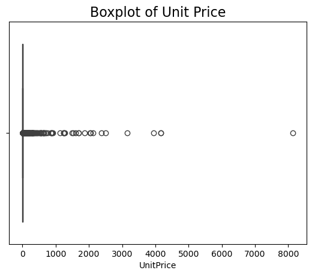

# UCL Online Retail Dataset

This is a transnational data set which contains all the transactions occurring from December 1st 2010 until December 9th 2011 for a UK-based and registered non-store online retail.The company mainly sells unique all-occasion gifts. Many customers of the company are wholesalers. Each row represents the transaction that occurs. It includes the product name, quantity, price, and other columns that represents ID.

Source: http://archive.ics.uci.edu/ml/datasets/Online+Retail (Dr Daqing Chen, Director: Public Analytics group. chend '@' lsbu.ac.uk, School of Engineering, London South Bank University, London SE1 0AA, UK.)

## Column Descriptions

| Column Name     | Description                                                                       | Data Type                                                                                                                                 |
| --------------- | --------------------------------------------------------------------------------- | ----------------------------------------------------------------------------------------------------------------------------------------- |
| **InvoiceNo**   | Invoice number. If this code starts with letter 'C', it indicates a cancellation. | Nominal, a 6-digit integral number uniquely assigned to each transaction.If this code starts with letter 'C', it indicates a cancellation |
| **StockCode**   | Product (item) code                                                               | Nominal, a 5-digit number uniquely assigned to each distinct product                                                                      |
| **Description** | Product (item) name                                                               | Nominal                                                                                                                                   |
| **Quantity**    | The quantities of each product (item) per transaction                             | Numeric                                                                                                                                   |
| **InvoiceDate** | Invoice Date and time when each transaction was generated                         | Numeric, the day and time                                                                                                                 |
| **UnitPrice**   | Unit price, Product price per unit in sterling                                    | Numeric                                                                                                                                   |
| **CustomerID**  | Customer number, uniquely assigned to each customer                               | Nominal, a 5-digit integral number                                                                                                        |
| **Country**     | Country name, the name of the country where each customer resides                 | Nominal                                                                                                                                   |

## Plan

1. reading data and preprocessing
2. creating Recency, Frequency, Monetary table
3. clustering with K-means algorithm
4. interpreting the result

```python
import sys
import pandas as pd
import numpy as np
import plotly.express as px
import plotly as py
import matplotlib.pyplot as plt
import seaborn as sns
from collections import Counter
from PIL import Image
import pandas as pd
from pathlib import Path
import calendar
%pip install termcolor
from termcolor import colored
from IPython.display import HTML
import warnings
warnings.filterwarnings('ignore')
py.offline.init_notebook_mode(connected=True)
```

    Requirement already satisfied: termcolor in /opt/anaconda3/lib/python3.12/site-packages (2.5.0)
    Note: you may need to restart the kernel to use updated packages.

<script type="text/javascript">
window.PlotlyConfig = {MathJaxConfig: 'local'};
if (window.MathJax && window.MathJax.Hub && window.MathJax.Hub.Config) {window.MathJax.Hub.Config({SVG: {font: "STIX-Web"}});}
if (typeof require !== 'undefined') {
require.undef("plotly");
requirejs.config({
    paths: {
        'plotly': ['https://cdn.plot.ly/plotly-2.32.0.min']
    }
});
require(['plotly'], function(Plotly) {
    window._Plotly = Plotly;
});
}
</script>

# Step 1 Read Data

```python
df=pd.read_excel('./Online Retail.xlsx')
df.head()
```

<div>
<style scoped>
    .dataframe tbody tr th:only-of-type {
        vertical-align: middle;
    }

    .dataframe tbody tr th {
        vertical-align: top;
    }

    .dataframe thead th {
        text-align: right;
    }

</style>
<table border="1" class="dataframe">
  <thead>
    <tr style="text-align: right;">
      <th></th>
      <th>InvoiceNo</th>
      <th>StockCode</th>
      <th>Description</th>
      <th>Quantity</th>
      <th>InvoiceDate</th>
      <th>UnitPrice</th>
      <th>CustomerID</th>
      <th>Country</th>
    </tr>
  </thead>
  <tbody>
    <tr>
      <th>0</th>
      <td>536365</td>
      <td>85123A</td>
      <td>WHITE HANGING HEART T-LIGHT HOLDER</td>
      <td>6</td>
      <td>2010-12-01 08:26:00</td>
      <td>2.55</td>
      <td>17850.0</td>
      <td>United Kingdom</td>
    </tr>
    <tr>
      <th>1</th>
      <td>536365</td>
      <td>71053</td>
      <td>WHITE METAL LANTERN</td>
      <td>6</td>
      <td>2010-12-01 08:26:00</td>
      <td>3.39</td>
      <td>17850.0</td>
      <td>United Kingdom</td>
    </tr>
    <tr>
      <th>2</th>
      <td>536365</td>
      <td>84406B</td>
      <td>CREAM CUPID HEARTS COAT HANGER</td>
      <td>8</td>
      <td>2010-12-01 08:26:00</td>
      <td>2.75</td>
      <td>17850.0</td>
      <td>United Kingdom</td>
    </tr>
    <tr>
      <th>3</th>
      <td>536365</td>
      <td>84029G</td>
      <td>KNITTED UNION FLAG HOT WATER BOTTLE</td>
      <td>6</td>
      <td>2010-12-01 08:26:00</td>
      <td>3.39</td>
      <td>17850.0</td>
      <td>United Kingdom</td>
    </tr>
    <tr>
      <th>4</th>
      <td>536365</td>
      <td>84029E</td>
      <td>RED WOOLLY HOTTIE WHITE HEART.</td>
      <td>6</td>
      <td>2010-12-01 08:26:00</td>
      <td>3.39</td>
      <td>17850.0</td>
      <td>United Kingdom</td>
    </tr>
  </tbody>
</table>
</div>

```python
df.info()
```

    <class 'pandas.core.frame.DataFrame'>
    RangeIndex: 541909 entries, 0 to 541908
    Data columns (total 8 columns):
     #   Column       Non-Null Count   Dtype
    ---  ------       --------------   -----
     0   InvoiceNo    541909 non-null  object
     1   StockCode    541909 non-null  object
     2   Description  540455 non-null  object
     3   Quantity     541909 non-null  int64
     4   InvoiceDate  541909 non-null  datetime64[ns]
     5   UnitPrice    541909 non-null  float64
     6   CustomerID   406829 non-null  float64
     7   Country      541909 non-null  object
    dtypes: datetime64[ns](1), float64(2), int64(1), object(4)
    memory usage: 33.1+ MB

```python
print("Number of rows in dataset is: ", df.shape[0])
print("Number of columns in dataset is: ", df.shape[1])
```

    Number of rows in dataset is:  541909
    Number of columns in dataset is:  8

# Step 2 Clean Data

## 2.1 Remove Cancelled Orders

```python
cancelled_condition=df['InvoiceNo'].astype(str).str.startswith('C')
canceled_order=df[cancelled_condition]
print(f'Number of cancelled orders:{canceled_order.shape[0]}')
print(f'{round((canceled_order.shape[0]/df.shape[0])*100,2)}% of cancelled orders')
df.drop(canceled_order.index,inplace=True)
```

    Number of cancelled orders:9288
    1.71% of cancelled orders

## 2.2 Remove Duplicates

```python
print(f'Duplicate record: {df.duplicated().sum()}')
print(f'{round((df.duplicated().sum()/df.shape[0]*100),2)}% rows are duplicated')
df.drop_duplicates(inplace=True)
```

    Duplicate record: 5231
    0.98% rows are duplicated

## 2.3 Handle Missing Values

```python
df.isnull().any()
```

    InvoiceNo      False
    StockCode      False
    Description     True
    Quantity       False
    InvoiceDate    False
    UnitPrice      False
    CustomerID      True
    Country        False
    dtype: bool

```python
df['Description']= df.groupby('StockCode')['Description'].transform(lambda x:x.fillna(method='ffill').fillna(method='bfill'))
```

```python
missing_custID=df[df['CustomerID'].isnull()]
print(f'{round((missing_custID.shape[0]/df.shape[0])*100,2)}% of records without customer ID')
df.drop(missing_custID.index,inplace=True)
```

    25.53% of records without customer ID

## 2.4 Column Type Transformation

```python
df['CustomerID']=df['CustomerID'].astype(int).astype(str)
```

## 2.5 Handle Outliers

```python
df.describe()
```

<div>
<style scoped>
    .dataframe tbody tr th:only-of-type {
        vertical-align: middle;
    }

    .dataframe tbody tr th {
        vertical-align: top;
    }

    .dataframe thead th {
        text-align: right;
    }

</style>
<table border="1" class="dataframe">
  <thead>
    <tr style="text-align: right;">
      <th></th>
      <th>Quantity</th>
      <th>InvoiceDate</th>
      <th>UnitPrice</th>
    </tr>
  </thead>
  <tbody>
    <tr>
      <th>count</th>
      <td>392732.000000</td>
      <td>392732</td>
      <td>392732.000000</td>
    </tr>
    <tr>
      <th>mean</th>
      <td>13.153718</td>
      <td>2011-07-10 19:15:24.576301568</td>
      <td>3.125596</td>
    </tr>
    <tr>
      <th>min</th>
      <td>1.000000</td>
      <td>2010-12-01 08:26:00</td>
      <td>0.000000</td>
    </tr>
    <tr>
      <th>25%</th>
      <td>2.000000</td>
      <td>2011-04-07 11:12:00</td>
      <td>1.250000</td>
    </tr>
    <tr>
      <th>50%</th>
      <td>6.000000</td>
      <td>2011-07-31 12:02:00</td>
      <td>1.950000</td>
    </tr>
    <tr>
      <th>75%</th>
      <td>12.000000</td>
      <td>2011-10-20 12:53:00</td>
      <td>3.750000</td>
    </tr>
    <tr>
      <th>max</th>
      <td>80995.000000</td>
      <td>2011-12-09 12:50:00</td>
      <td>8142.750000</td>
    </tr>
    <tr>
      <th>std</th>
      <td>181.588420</td>
      <td>NaN</td>
      <td>22.240725</td>
    </tr>
  </tbody>
</table>
</div>

```python
negative_price=df[df['UnitPrice']<= 0]
negative_quantity=df[df['Quantity']<= 0]
print(f'{round((negative_price.shape[0]/df.shape[0])*100,2)}% negative price')
print(f'{round((negative_quantity.shape[0]/df.shape[0])*100,2)}% negative quantity')
df=df.loc[(df['UnitPrice']>0) & (df['Quantity']>0)]

```

    0.01% negative price
    0.0% negative quantity

```python
df.describe()
```

<div>
<style scoped>
    .dataframe tbody tr th:only-of-type {
        vertical-align: middle;
    }

    .dataframe tbody tr th {
        vertical-align: top;
    }

    .dataframe thead th {
        text-align: right;
    }

</style>
<table border="1" class="dataframe">
  <thead>
    <tr style="text-align: right;">
      <th></th>
      <th>Quantity</th>
      <th>InvoiceDate</th>
      <th>UnitPrice</th>
    </tr>
  </thead>
  <tbody>
    <tr>
      <th>count</th>
      <td>392692.000000</td>
      <td>392692</td>
      <td>392692.000000</td>
    </tr>
    <tr>
      <th>mean</th>
      <td>13.119702</td>
      <td>2011-07-10 19:13:07.771892480</td>
      <td>3.125914</td>
    </tr>
    <tr>
      <th>min</th>
      <td>1.000000</td>
      <td>2010-12-01 08:26:00</td>
      <td>0.001000</td>
    </tr>
    <tr>
      <th>25%</th>
      <td>2.000000</td>
      <td>2011-04-07 11:12:00</td>
      <td>1.250000</td>
    </tr>
    <tr>
      <th>50%</th>
      <td>6.000000</td>
      <td>2011-07-31 12:02:00</td>
      <td>1.950000</td>
    </tr>
    <tr>
      <th>75%</th>
      <td>12.000000</td>
      <td>2011-10-20 12:53:00</td>
      <td>3.750000</td>
    </tr>
    <tr>
      <th>max</th>
      <td>80995.000000</td>
      <td>2011-12-09 12:50:00</td>
      <td>8142.750000</td>
    </tr>
    <tr>
      <th>std</th>
      <td>180.492832</td>
      <td>NaN</td>
      <td>22.241836</td>
    </tr>
  </tbody>
</table>
</div>

for price and quantity, there are some negative values which are wrong values,since they have a vary small percentage, remove them. However, the price and quantity columns still extrame values, which requires further exploratory.

```python
sns.boxplot(data=df,x='UnitPrice')
plt.title('Boxplot of Unit Price',fontsize=16)
plt.show()


```



```python
df[df['UnitPrice']>1000]
```

<div>
<style scoped>
    .dataframe tbody tr th:only-of-type {
        vertical-align: middle;
    }

    .dataframe tbody tr th {
        vertical-align: top;
    }

    .dataframe thead th {
        text-align: right;
    }

</style>
<table border="1" class="dataframe">
  <thead>
    <tr style="text-align: right;">
      <th></th>
      <th>InvoiceNo</th>
      <th>StockCode</th>
      <th>Description</th>
      <th>Quantity</th>
      <th>InvoiceDate</th>
      <th>UnitPrice</th>
      <th>CustomerID</th>
      <th>Country</th>
    </tr>
  </thead>
  <tbody>
    <tr>
      <th>117054</th>
      <td>546328</td>
      <td>M</td>
      <td>Manual</td>
      <td>1</td>
      <td>2011-03-11 10:19:00</td>
      <td>1687.17</td>
      <td>14911</td>
      <td>EIRE</td>
    </tr>
    <tr>
      <th>117055</th>
      <td>546329</td>
      <td>M</td>
      <td>Manual</td>
      <td>1</td>
      <td>2011-03-11 10:22:00</td>
      <td>1687.17</td>
      <td>14911</td>
      <td>EIRE</td>
    </tr>
    <tr>
      <th>144826</th>
      <td>548813</td>
      <td>M</td>
      <td>Manual</td>
      <td>1</td>
      <td>2011-04-04 13:03:00</td>
      <td>2382.92</td>
      <td>12744</td>
      <td>Singapore</td>
    </tr>
    <tr>
      <th>144828</th>
      <td>548813</td>
      <td>M</td>
      <td>Manual</td>
      <td>1</td>
      <td>2011-04-04 13:03:00</td>
      <td>1252.95</td>
      <td>12744</td>
      <td>Singapore</td>
    </tr>
    <tr>
      <th>144829</th>
      <td>548820</td>
      <td>M</td>
      <td>Manual</td>
      <td>1</td>
      <td>2011-04-04 13:04:00</td>
      <td>2053.07</td>
      <td>12744</td>
      <td>Singapore</td>
    </tr>
    <tr>
      <th>145831</th>
      <td>548913</td>
      <td>M</td>
      <td>Manual</td>
      <td>1</td>
      <td>2011-04-05 09:45:00</td>
      <td>1136.30</td>
      <td>12669</td>
      <td>France</td>
    </tr>
    <tr>
      <th>150615</th>
      <td>549468</td>
      <td>M</td>
      <td>Manual</td>
      <td>1</td>
      <td>2011-04-08 14:27:00</td>
      <td>1867.86</td>
      <td>17940</td>
      <td>United Kingdom</td>
    </tr>
    <tr>
      <th>173382</th>
      <td>551697</td>
      <td>POST</td>
      <td>POSTAGE</td>
      <td>1</td>
      <td>2011-05-03 13:46:00</td>
      <td>8142.75</td>
      <td>16029</td>
      <td>United Kingdom</td>
    </tr>
    <tr>
      <th>200745</th>
      <td>554155</td>
      <td>M</td>
      <td>Manual</td>
      <td>1</td>
      <td>2011-05-23 11:26:00</td>
      <td>1241.98</td>
      <td>12757</td>
      <td>Portugal</td>
    </tr>
    <tr>
      <th>201553</th>
      <td>554301</td>
      <td>M</td>
      <td>Manual</td>
      <td>1</td>
      <td>2011-05-23 14:46:00</td>
      <td>1241.98</td>
      <td>12757</td>
      <td>Portugal</td>
    </tr>
    <tr>
      <th>297438</th>
      <td>562946</td>
      <td>M</td>
      <td>Manual</td>
      <td>1</td>
      <td>2011-08-11 09:38:00</td>
      <td>2500.00</td>
      <td>15581</td>
      <td>United Kingdom</td>
    </tr>
    <tr>
      <th>343000</th>
      <td>566927</td>
      <td>M</td>
      <td>Manual</td>
      <td>1</td>
      <td>2011-09-15 15:20:00</td>
      <td>2033.10</td>
      <td>17846</td>
      <td>United Kingdom</td>
    </tr>
    <tr>
      <th>374542</th>
      <td>569382</td>
      <td>M</td>
      <td>Manual</td>
      <td>1</td>
      <td>2011-10-03 16:44:00</td>
      <td>3155.95</td>
      <td>15502</td>
      <td>United Kingdom</td>
    </tr>
    <tr>
      <th>406406</th>
      <td>571751</td>
      <td>M</td>
      <td>Manual</td>
      <td>1</td>
      <td>2011-10-19 11:18:00</td>
      <td>3949.32</td>
      <td>12744</td>
      <td>Singapore</td>
    </tr>
    <tr>
      <th>406407</th>
      <td>571751</td>
      <td>M</td>
      <td>Manual</td>
      <td>1</td>
      <td>2011-10-19 11:18:00</td>
      <td>2118.74</td>
      <td>12744</td>
      <td>Singapore</td>
    </tr>
    <tr>
      <th>422351</th>
      <td>573077</td>
      <td>M</td>
      <td>Manual</td>
      <td>1</td>
      <td>2011-10-27 14:13:00</td>
      <td>4161.06</td>
      <td>12536</td>
      <td>France</td>
    </tr>
    <tr>
      <th>422376</th>
      <td>573080</td>
      <td>M</td>
      <td>Manual</td>
      <td>1</td>
      <td>2011-10-27 14:20:00</td>
      <td>4161.06</td>
      <td>12536</td>
      <td>France</td>
    </tr>
    <tr>
      <th>467436</th>
      <td>576339</td>
      <td>DOT</td>
      <td>DOTCOM POSTAGE</td>
      <td>1</td>
      <td>2011-11-14 15:27:00</td>
      <td>1500.36</td>
      <td>14096</td>
      <td>United Kingdom</td>
    </tr>
    <tr>
      <th>494728</th>
      <td>578270</td>
      <td>DOT</td>
      <td>DOTCOM POSTAGE</td>
      <td>1</td>
      <td>2011-11-23 13:39:00</td>
      <td>1270.06</td>
      <td>14096</td>
      <td>United Kingdom</td>
    </tr>
    <tr>
      <th>508459</th>
      <td>579196</td>
      <td>DOT</td>
      <td>DOTCOM POSTAGE</td>
      <td>1</td>
      <td>2011-11-28 15:54:00</td>
      <td>1526.76</td>
      <td>14096</td>
      <td>United Kingdom</td>
    </tr>
    <tr>
      <th>528082</th>
      <td>580727</td>
      <td>DOT</td>
      <td>DOTCOM POSTAGE</td>
      <td>1</td>
      <td>2011-12-05 17:17:00</td>
      <td>1599.26</td>
      <td>14096</td>
      <td>United Kingdom</td>
    </tr>
  </tbody>
</table>
</div>

the extrame high unit price values mostly come from postage and manual fee, these will not be used for the RFM analysis, so they can be removed

```python
non_related_orders=df[(df['StockCode']=='M')|(df['StockCode']=='POST')|(df['StockCode']=='DOT')]
df.drop(non_related_orders.index,inplace=True)
df.describe()
```

<div>
<style scoped>
    .dataframe tbody tr th:only-of-type {
        vertical-align: middle;
    }

    .dataframe tbody tr th {
        vertical-align: top;
    }

    .dataframe thead th {
        text-align: right;
    }

</style>
<table border="1" class="dataframe">
  <thead>
    <tr style="text-align: right;">
      <th></th>
      <th>Quantity</th>
      <th>InvoiceDate</th>
      <th>UnitPrice</th>
    </tr>
  </thead>
  <tbody>
    <tr>
      <th>count</th>
      <td>391298.000000</td>
      <td>391298</td>
      <td>391298.000000</td>
    </tr>
    <tr>
      <th>mean</th>
      <td>13.140709</td>
      <td>2011-07-10 19:38:55.997475328</td>
      <td>2.890748</td>
    </tr>
    <tr>
      <th>min</th>
      <td>1.000000</td>
      <td>2010-12-01 08:26:00</td>
      <td>0.001000</td>
    </tr>
    <tr>
      <th>25%</th>
      <td>2.000000</td>
      <td>2011-04-07 11:16:00</td>
      <td>1.250000</td>
    </tr>
    <tr>
      <th>50%</th>
      <td>6.000000</td>
      <td>2011-07-31 12:05:00</td>
      <td>1.950000</td>
    </tr>
    <tr>
      <th>75%</th>
      <td>12.000000</td>
      <td>2011-10-20 12:57:00</td>
      <td>3.750000</td>
    </tr>
    <tr>
      <th>max</th>
      <td>80995.000000</td>
      <td>2011-12-09 12:50:00</td>
      <td>649.500000</td>
    </tr>
    <tr>
      <th>std</th>
      <td>180.773788</td>
      <td>NaN</td>
      <td>4.375676</td>
    </tr>
  </tbody>
</table>
</div>

```python
df[df['UnitPrice']<0.01]
```

<div>
<style scoped>
    .dataframe tbody tr th:only-of-type {
        vertical-align: middle;
    }

    .dataframe tbody tr th {
        vertical-align: top;
    }

    .dataframe thead th {
        text-align: right;
    }

</style>
<table border="1" class="dataframe">
  <thead>
    <tr style="text-align: right;">
      <th></th>
      <th>InvoiceNo</th>
      <th>StockCode</th>
      <th>Description</th>
      <th>Quantity</th>
      <th>InvoiceDate</th>
      <th>UnitPrice</th>
      <th>CustomerID</th>
      <th>Country</th>
    </tr>
  </thead>
  <tbody>
    <tr>
      <th>157195</th>
      <td>550193</td>
      <td>PADS</td>
      <td>PADS TO MATCH ALL CUSHIONS</td>
      <td>1</td>
      <td>2011-04-15 09:27:00</td>
      <td>0.001</td>
      <td>13952</td>
      <td>United Kingdom</td>
    </tr>
    <tr>
      <th>279045</th>
      <td>561226</td>
      <td>PADS</td>
      <td>PADS TO MATCH ALL CUSHIONS</td>
      <td>1</td>
      <td>2011-07-26 10:13:00</td>
      <td>0.001</td>
      <td>15618</td>
      <td>United Kingdom</td>
    </tr>
    <tr>
      <th>359871</th>
      <td>568200</td>
      <td>PADS</td>
      <td>PADS TO MATCH ALL CUSHIONS</td>
      <td>1</td>
      <td>2011-09-25 14:58:00</td>
      <td>0.001</td>
      <td>16198</td>
      <td>United Kingdom</td>
    </tr>
    <tr>
      <th>361741</th>
      <td>568375</td>
      <td>BANK CHARGES</td>
      <td>Bank Charges</td>
      <td>1</td>
      <td>2011-09-26 17:01:00</td>
      <td>0.001</td>
      <td>13405</td>
      <td>United Kingdom</td>
    </tr>
  </tbody>
</table>
</div>

the extrame low values of unit price are normal orders, keep them

```python
sns.boxplot(data=df,x='Quantity')
plt.title('Boxplot of Quantity',fontsize=16)
plt.show()
```


```python
df[df['Quantity']>10000]
```

<div>
<style scoped>
    .dataframe tbody tr th:only-of-type {
        vertical-align: middle;
    }

    .dataframe tbody tr th {
        vertical-align: top;
    }

    .dataframe thead th {
        text-align: right;
    }

</style>
<table border="1" class="dataframe">
  <thead>
    <tr style="text-align: right;">
      <th></th>
      <th>InvoiceNo</th>
      <th>StockCode</th>
      <th>Description</th>
      <th>Quantity</th>
      <th>InvoiceDate</th>
      <th>UnitPrice</th>
      <th>CustomerID</th>
      <th>Country</th>
    </tr>
  </thead>
  <tbody>
    <tr>
      <th>61619</th>
      <td>541431</td>
      <td>23166</td>
      <td>MEDIUM CERAMIC TOP STORAGE JAR</td>
      <td>74215</td>
      <td>2011-01-18 10:01:00</td>
      <td>1.04</td>
      <td>12346</td>
      <td>United Kingdom</td>
    </tr>
    <tr>
      <th>540421</th>
      <td>581483</td>
      <td>23843</td>
      <td>PAPER CRAFT , LITTLE BIRDIE</td>
      <td>80995</td>
      <td>2011-12-09 09:15:00</td>
      <td>2.08</td>
      <td>16446</td>
      <td>United Kingdom</td>
    </tr>
  </tbody>
</table>
</div>

```python
df.loc[(df['CustomerID']=='12346')& (df['StockCode']==23166)]
df.loc[df['StockCode']==23166]
```

<div>
<style scoped>
    .dataframe tbody tr th:only-of-type {
        vertical-align: middle;
    }

    .dataframe tbody tr th {
        vertical-align: top;
    }

    .dataframe thead th {
        text-align: right;
    }

</style>
<table border="1" class="dataframe">
  <thead>
    <tr style="text-align: right;">
      <th></th>
      <th>InvoiceNo</th>
      <th>StockCode</th>
      <th>Description</th>
      <th>Quantity</th>
      <th>InvoiceDate</th>
      <th>UnitPrice</th>
      <th>CustomerID</th>
      <th>Country</th>
    </tr>
  </thead>
  <tbody>
    <tr>
      <th>61619</th>
      <td>541431</td>
      <td>23166</td>
      <td>MEDIUM CERAMIC TOP STORAGE JAR</td>
      <td>74215</td>
      <td>2011-01-18 10:01:00</td>
      <td>1.04</td>
      <td>12346</td>
      <td>United Kingdom</td>
    </tr>
    <tr>
      <th>186770</th>
      <td>552882</td>
      <td>23166</td>
      <td>MEDIUM CERAMIC TOP STORAGE JAR</td>
      <td>96</td>
      <td>2011-05-12 10:10:00</td>
      <td>1.04</td>
      <td>14646</td>
      <td>Netherlands</td>
    </tr>
    <tr>
      <th>187196</th>
      <td>552953</td>
      <td>23166</td>
      <td>MEDIUM CERAMIC TOP STORAGE JAR</td>
      <td>4</td>
      <td>2011-05-12 12:11:00</td>
      <td>1.25</td>
      <td>16745</td>
      <td>United Kingdom</td>
    </tr>
    <tr>
      <th>187718</th>
      <td>553005</td>
      <td>23166</td>
      <td>MEDIUM CERAMIC TOP STORAGE JAR</td>
      <td>5</td>
      <td>2011-05-12 16:29:00</td>
      <td>1.25</td>
      <td>14651</td>
      <td>United Kingdom</td>
    </tr>
    <tr>
      <th>187868</th>
      <td>553009</td>
      <td>23166</td>
      <td>MEDIUM CERAMIC TOP STORAGE JAR</td>
      <td>3</td>
      <td>2011-05-12 16:52:00</td>
      <td>1.25</td>
      <td>13601</td>
      <td>United Kingdom</td>
    </tr>
    <tr>
      <th>...</th>
      <td>...</td>
      <td>...</td>
      <td>...</td>
      <td>...</td>
      <td>...</td>
      <td>...</td>
      <td>...</td>
      <td>...</td>
    </tr>
    <tr>
      <th>526381</th>
      <td>580665</td>
      <td>23166</td>
      <td>MEDIUM CERAMIC TOP STORAGE JAR</td>
      <td>96</td>
      <td>2011-12-05 14:06:00</td>
      <td>1.04</td>
      <td>16684</td>
      <td>United Kingdom</td>
    </tr>
    <tr>
      <th>531499</th>
      <td>580956</td>
      <td>23166</td>
      <td>MEDIUM CERAMIC TOP STORAGE JAR</td>
      <td>1</td>
      <td>2011-12-06 14:23:00</td>
      <td>1.25</td>
      <td>17841</td>
      <td>United Kingdom</td>
    </tr>
    <tr>
      <th>532826</th>
      <td>580997</td>
      <td>23166</td>
      <td>MEDIUM CERAMIC TOP STORAGE JAR</td>
      <td>4</td>
      <td>2011-12-06 17:23:00</td>
      <td>1.25</td>
      <td>15023</td>
      <td>United Kingdom</td>
    </tr>
    <tr>
      <th>533742</th>
      <td>581108</td>
      <td>23166</td>
      <td>MEDIUM CERAMIC TOP STORAGE JAR</td>
      <td>2</td>
      <td>2011-12-07 12:16:00</td>
      <td>1.25</td>
      <td>15984</td>
      <td>United Kingdom</td>
    </tr>
    <tr>
      <th>540301</th>
      <td>581476</td>
      <td>23166</td>
      <td>MEDIUM CERAMIC TOP STORAGE JAR</td>
      <td>48</td>
      <td>2011-12-09 08:48:00</td>
      <td>1.04</td>
      <td>12433</td>
      <td>Norway</td>
    </tr>
  </tbody>
</table>
<p>198 rows × 8 columns</p>
</div>

```python
df.loc[(df['CustomerID']=='16446')& (df['StockCode']==23843)]
df.loc[df['StockCode']==23843]

```

<div>
<style scoped>
    .dataframe tbody tr th:only-of-type {
        vertical-align: middle;
    }

    .dataframe tbody tr th {
        vertical-align: top;
    }

    .dataframe thead th {
        text-align: right;
    }

</style>
<table border="1" class="dataframe">
  <thead>
    <tr style="text-align: right;">
      <th></th>
      <th>InvoiceNo</th>
      <th>StockCode</th>
      <th>Description</th>
      <th>Quantity</th>
      <th>InvoiceDate</th>
      <th>UnitPrice</th>
      <th>CustomerID</th>
      <th>Country</th>
    </tr>
  </thead>
  <tbody>
    <tr>
      <th>540421</th>
      <td>581483</td>
      <td>23843</td>
      <td>PAPER CRAFT , LITTLE BIRDIE</td>
      <td>80995</td>
      <td>2011-12-09 09:15:00</td>
      <td>2.08</td>
      <td>16446</td>
      <td>United Kingdom</td>
    </tr>
  </tbody>
</table>
</div>

after analyzing the StockCode and CustomerID,the two high quantity orders are considered as outliers, as they are not aligned with normal purchase patterns.

```python
df=df[df['Quantity']<10000]
df.describe()
```

<div>
<style scoped>
    .dataframe tbody tr th:only-of-type {
        vertical-align: middle;
    }

    .dataframe tbody tr th {
        vertical-align: top;
    }

    .dataframe thead th {
        text-align: right;
    }

</style>
<table border="1" class="dataframe">
  <thead>
    <tr style="text-align: right;">
      <th></th>
      <th>Quantity</th>
      <th>InvoiceDate</th>
      <th>UnitPrice</th>
    </tr>
  </thead>
  <tbody>
    <tr>
      <th>count</th>
      <td>391296.000000</td>
      <td>391296</td>
      <td>391296.000000</td>
    </tr>
    <tr>
      <th>mean</th>
      <td>12.744120</td>
      <td>2011-07-10 19:39:00.818663936</td>
      <td>2.890754</td>
    </tr>
    <tr>
      <th>min</th>
      <td>1.000000</td>
      <td>2010-12-01 08:26:00</td>
      <td>0.001000</td>
    </tr>
    <tr>
      <th>25%</th>
      <td>2.000000</td>
      <td>2011-04-07 11:16:00</td>
      <td>1.250000</td>
    </tr>
    <tr>
      <th>50%</th>
      <td>6.000000</td>
      <td>2011-07-31 12:05:00</td>
      <td>1.950000</td>
    </tr>
    <tr>
      <th>75%</th>
      <td>12.000000</td>
      <td>2011-10-20 12:57:00</td>
      <td>3.750000</td>
    </tr>
    <tr>
      <th>max</th>
      <td>4800.000000</td>
      <td>2011-12-09 12:50:00</td>
      <td>649.500000</td>
    </tr>
    <tr>
      <th>std</th>
      <td>42.991524</td>
      <td>NaN</td>
      <td>4.375686</td>
    </tr>
  </tbody>
</table>
</div>

```python

```

# Step 3 Create Recency Frequency Monetary (RFM) table

```python
# create revenue column
df['Revenue']=df['UnitPrice']*df['Quantity']

```

```python
# create rfm table
from datetime import timedelta
max_date=df['InvoiceDate'].max()+timedelta(days=1)
rfm=df.groupby('CustomerID').agg({
 'InvoiceDate':lambda x:(max_date-x.max()).days,
  'InvoiceNo':lambda x:x.count(),
  'Revenue':lambda x:x.sum()}).reset_index()
rfm.rename(columns={'InvoiceDate': 'Recency',
                         'InvoiceNo': 'Frequency',
                         'Revenue': 'MonetaryValue'},inplace=True)
rfm.head()
```

<div>
<style scoped>
    .dataframe tbody tr th:only-of-type {
        vertical-align: middle;
    }

    .dataframe tbody tr th {
        vertical-align: top;
    }

    .dataframe thead th {
        text-align: right;
    }

</style>
<table border="1" class="dataframe">
  <thead>
    <tr style="text-align: right;">
      <th></th>
      <th>CustomerID</th>
      <th>Recency</th>
      <th>Frequency</th>
      <th>MonetaryValue</th>
    </tr>
  </thead>
  <tbody>
    <tr>
      <th>0</th>
      <td>12347</td>
      <td>2</td>
      <td>182</td>
      <td>4310.00</td>
    </tr>
    <tr>
      <th>1</th>
      <td>12348</td>
      <td>75</td>
      <td>27</td>
      <td>1437.24</td>
    </tr>
    <tr>
      <th>2</th>
      <td>12349</td>
      <td>19</td>
      <td>72</td>
      <td>1457.55</td>
    </tr>
    <tr>
      <th>3</th>
      <td>12350</td>
      <td>310</td>
      <td>16</td>
      <td>294.40</td>
    </tr>
    <tr>
      <th>4</th>
      <td>12352</td>
      <td>36</td>
      <td>77</td>
      <td>1385.74</td>
    </tr>
  </tbody>
</table>
</div>

# Step 4 Manage Skewness and Scaling

## Recency, Frequency,MonetaryValue distributions

```python
plt.figure(figsize=(12,10))
plt.subplot(3,1,1);sns.kdeplot(data=rfm,x='Recency',shade=True)
plt.subplot(3,1,2);sns.kdeplot(data=rfm,x='Frequency',shade=True)
plt.subplot(3,1,3);sns.kdeplot(data=rfm,x='MonetaryValue',shade=True)
plt.show()
```


### Analysis:

#### **Recency (Recent Purchase Time):**

**Skewness**: Although this feature shows a certain peak and has less skewness compared to the other two features, it still exhibits some skew.

#### **Frequency (Purchase Frequency):**

**Extreme Skewness**: This feature shows a **strong skew**, where most customers have a low purchase frequency, and only a few customers have an exceptionally high frequency. This distribution may cause K-means clustering to be influenced by a small number of highly frequent customers.

#### **Monetary Value:**

**Extreme Skewness**: This feature exhibits a similar **long-tailed distribution** as Frequency, where a few customers contribute most of the revenue. High-spending customers will disproportionately affect the K-means clustering results.

#### **Transform Skewed Data:**

There are some methods that we can use to manage the skewness:

- log transformation
- square root transformation
- box-cox transformation Note: We can use the transformation if and only if the variable only has positive values

```python
from scipy import stats
def analyze_skewness(x):
    fig,ax=plt.subplots(2,2,figsize=(5,5))
    sns.kdeplot(rfm[x],ax=ax[0,0])
    sns.kdeplot(np.log(rfm[x]),ax=ax[0,1])
    sns.kdeplot(np.sqrt(rfm[x]),ax=ax[1,0])
    sns.kdeplot(stats.boxcox(rfm[x])[0], ax=ax[1,1])
    plt.show()
    print(f'log transform: the skew coefficient of {rfm[x].skew().round(2)} to {(np.log(rfm[x].skew()).round(2))}')
    print(f'square root transform: the skew coefficient of {rfm[x].skew().round(2)} to {(np.sqrt(rfm[x].skew()).round(2))}')
    print(f'box-cox transform : The skew coefficient of {rfm[x].skew().round(2)} to  {pd.Series(stats.boxcox(rfm[x])[0]).skew().round(2)}')
```

```python
analyze_skewness('Recency')
```


    log transform: the skew coefficient of 1.24 to 0.22
    square root transform: the skew coefficient of 1.24 to 1.12
    box-cox transform : The skew coefficient of 1.24 to  -0.07

```python
analyze_skewness('Frequency')
```


    log transform: the skew coefficient of 18.05 to 2.89
    square root transform: the skew coefficient of 18.05 to 4.25
    box-cox transform : The skew coefficient of 18.05 to  0.0

```python
analyze_skewness('MonetaryValue')
```


    log transform: the skew coefficient of 20.89 to 3.04
    square root transform: the skew coefficient of 20.89 to 4.57
    box-cox transform : The skew coefficient of 20.89 to  -0.02

box-cox can minimize the skewness

```python
rfm_trans=pd.DataFrame()
rfm_trans['Recency']=stats.boxcox(rfm['Recency']) [0]
rfm_trans['Frequency']=stats.boxcox(rfm['Frequency']) [0]
rfm_trans['MonetaryValue']=stats.boxcox(rfm['MonetaryValue']) [0]
rfm_trans.head()
```

<div>
<style scoped>
    .dataframe tbody tr th:only-of-type {
        vertical-align: middle;
    }

    .dataframe tbody tr th {
        vertical-align: top;
    }

    .dataframe thead th {
        text-align: right;
    }

</style>
<table border="1" class="dataframe">
  <thead>
    <tr style="text-align: right;">
      <th></th>
      <th>Recency</th>
      <th>Frequency</th>
      <th>MonetaryValue</th>
    </tr>
  </thead>
  <tbody>
    <tr>
      <th>0</th>
      <td>0.737062</td>
      <td>5.957712</td>
      <td>6.231084</td>
    </tr>
    <tr>
      <th>1</th>
      <td>6.457709</td>
      <td>3.588181</td>
      <td>5.616776</td>
    </tr>
    <tr>
      <th>2</th>
      <td>3.854918</td>
      <td>4.777427</td>
      <td>5.624946</td>
    </tr>
    <tr>
      <th>3</th>
      <td>9.895048</td>
      <td>2.977602</td>
      <td>4.636555</td>
    </tr>
    <tr>
      <th>4</th>
      <td>4.988674</td>
      <td>4.861022</td>
      <td>5.595491</td>
    </tr>
  </tbody>
</table>
</div>

#### Standardization

```python
from sklearn.preprocessing import StandardScaler
# Initialize the scaler object
scaler = StandardScaler()
# fit and transform data
scaler.fit(rfm_trans)
rfm_standard=scaler.transform(rfm_trans)
print(rfm_standard.mean(axis=0).round(2))
print(rfm_standard.std(axis=0).round(2))

```

    [-0.  0.  0.]
    [1. 1. 1.]

# Step 5 Clustering with K-means algorithm

## Determine the Optimal K

To make our clustering reach its maximum performance, we have to determine which hyperparameter fits to the data. To determine which hyperparameter is the best for our model and data, we can use the elbow method to decide.

```python
from sklearn.cluster import KMeans
from scipy.spatial.distance import cdist
distortions=[]
inertias=[]
mapping1={}
sse={}
for k in range (1,20):
    kmeans=KMeans(n_clusters=k,random_state=42)
    kmeans.fit(rfm_standard)
    distortions.append(sum(np.min(cdist(rfm_standard,kmeans.cluster_centers_,'euclidean'),axis=1))/rfm_standard.shape[0])
    inertias.append(kmeans.inertia_)
    sse[k]=kmeans.inertia_
plt.figure(figsize=(12,8))
plt.title('The Elbow Method')
plt.xlabel('k')
plt.ylabel('SSE')
sns.pointplot(x=list(sse.keys()),y=list(sse.values()))
plt.show()


```


The best k value corresponds to the "elbow" in the chart, where the rate of decrease in SSE slows down significantly. k=3 or k=4 are the best k in this case.

### 3 Clusters

```python
model=KMeans(n_clusters=3,random_state=42)
model.fit(rfm_standard)
model.labels_.shape
```

    (4334,)

```python
rfm_standard.shape
```

    (4334, 3)

```python
rfm['Cluster']=model.labels_
rfm.head()
rfm.groupby('Cluster').agg({'Recency':'mean','Frequency':'mean','MonetaryValue':'mean'}).round(1)
```

<div>
<style scoped>
    .dataframe tbody tr th:only-of-type {
        vertical-align: middle;
    }

    .dataframe tbody tr th {
        vertical-align: top;
    }

    .dataframe thead th {
        text-align: right;
    }

</style>
<table border="1" class="dataframe">
  <thead>
    <tr style="text-align: right;">
      <th></th>
      <th>Recency</th>
      <th>Frequency</th>
      <th>MonetaryValue</th>
    </tr>
    <tr>
      <th>Cluster</th>
      <th></th>
      <th></th>
      <th></th>
    </tr>
  </thead>
  <tbody>
    <tr>
      <th>0</th>
      <td>64.3</td>
      <td>51.1</td>
      <td>916.1</td>
    </tr>
    <tr>
      <th>1</th>
      <td>20.2</td>
      <td>241.5</td>
      <td>5613.5</td>
    </tr>
    <tr>
      <th>2</th>
      <td>193.0</td>
      <td>15.2</td>
      <td>282.2</td>
    </tr>
  </tbody>
</table>
</div>

### 4 Clusters

```python
model=KMeans(n_clusters=4,random_state=42)
model.fit(rfm_standard)
model.labels_.shape
```

    (4334,)

```python
rfm['Cluster']=model.labels_
rfm.head()
rfm.groupby('Cluster').agg(
    {
     'Recency':'mean','Frequency':'mean','MonetaryValue':'mean'
    }
).round(1)
```

<div>
<style scoped>
    .dataframe tbody tr th:only-of-type {
        vertical-align: middle;
    }

    .dataframe tbody tr th {
        vertical-align: top;
    }

    .dataframe thead th {
        text-align: right;
    }

</style>
<table border="1" class="dataframe">
  <thead>
    <tr style="text-align: right;">
      <th></th>
      <th>Recency</th>
      <th>Frequency</th>
      <th>MonetaryValue</th>
    </tr>
    <tr>
      <th>Cluster</th>
      <th></th>
      <th></th>
      <th></th>
    </tr>
  </thead>
  <tbody>
    <tr>
      <th>0</th>
      <td>28.3</td>
      <td>30.4</td>
      <td>481.4</td>
    </tr>
    <tr>
      <th>1</th>
      <td>17.7</td>
      <td>230.5</td>
      <td>5335.5</td>
    </tr>
    <tr>
      <th>2</th>
      <td>123.0</td>
      <td>62.7</td>
      <td>1193.3</td>
    </tr>
    <tr>
      <th>3</th>
      <td>210.8</td>
      <td>12.9</td>
      <td>246.1</td>
    </tr>
  </tbody>
</table>
</div>

From the above table, we can compare the distribution of mean values of recency, frequency, and monetary metrics across 3 and 4 cluster data. It seems that we get a more detailed distribution of our customer base using k=4. However, this may not be a very visually appealing method to extract insights.

Another commonly used method to compare the cluster segments is Snakeplots. They are commonly used in marketing research to understand customer perceptions.

Let us build a snake plot for our data with 4 clusters below.

## Cluster Exploration and Visualization

```python
rfm_snake=pd.DataFrame(rfm_standard,columns=['Recency', 'Frequency', 'MonetaryValue'])
rfm_snake['ID']=rfm.index
rfm_snake['Cluster']=model.labels_
rfm_snake.head()

```

<div>
<style scoped>
    .dataframe tbody tr th:only-of-type {
        vertical-align: middle;
    }

    .dataframe tbody tr th {
        vertical-align: top;
    }

    .dataframe thead th {
        text-align: right;
    }

</style>
<table border="1" class="dataframe">
  <thead>
    <tr style="text-align: right;">
      <th></th>
      <th>Recency</th>
      <th>Frequency</th>
      <th>MonetaryValue</th>
      <th>ID</th>
      <th>Cluster</th>
    </tr>
  </thead>
  <tbody>
    <tr>
      <th>0</th>
      <td>-1.842590</td>
      <td>1.180306</td>
      <td>1.397571</td>
      <td>0</td>
      <td>1</td>
    </tr>
    <tr>
      <th>1</th>
      <td>0.289900</td>
      <td>-0.314024</td>
      <td>0.594845</td>
      <td>1</td>
      <td>2</td>
    </tr>
    <tr>
      <th>2</th>
      <td>-0.680344</td>
      <td>0.435967</td>
      <td>0.605520</td>
      <td>2</td>
      <td>1</td>
    </tr>
    <tr>
      <th>3</th>
      <td>1.571241</td>
      <td>-0.699082</td>
      <td>-0.686027</td>
      <td>3</td>
      <td>3</td>
    </tr>
    <tr>
      <th>4</th>
      <td>-0.257713</td>
      <td>0.488686</td>
      <td>0.567031</td>
      <td>4</td>
      <td>2</td>
    </tr>
  </tbody>
</table>
</div>

```python
rfm_melt=pd.melt(rfm_snake.reset_index(),
                 id_vars=['ID','Cluster'],
                 value_vars=['Recency', 'Frequency', 'MonetaryValue'],
                 var_name='Attribute',
                 value_name='Value')
rfm_melt.head()
```

<div>
<style scoped>
    .dataframe tbody tr th:only-of-type {
        vertical-align: middle;
    }

    .dataframe tbody tr th {
        vertical-align: top;
    }

    .dataframe thead th {
        text-align: right;
    }

</style>
<table border="1" class="dataframe">
  <thead>
    <tr style="text-align: right;">
      <th></th>
      <th>ID</th>
      <th>Cluster</th>
      <th>Attribute</th>
      <th>Value</th>
    </tr>
  </thead>
  <tbody>
    <tr>
      <th>0</th>
      <td>0</td>
      <td>1</td>
      <td>Recency</td>
      <td>-1.842590</td>
    </tr>
    <tr>
      <th>1</th>
      <td>1</td>
      <td>2</td>
      <td>Recency</td>
      <td>0.289900</td>
    </tr>
    <tr>
      <th>2</th>
      <td>2</td>
      <td>1</td>
      <td>Recency</td>
      <td>-0.680344</td>
    </tr>
    <tr>
      <th>3</th>
      <td>3</td>
      <td>3</td>
      <td>Recency</td>
      <td>1.571241</td>
    </tr>
    <tr>
      <th>4</th>
      <td>4</td>
      <td>2</td>
      <td>Recency</td>
      <td>-0.257713</td>
    </tr>
  </tbody>
</table>
</div>

```python
rfm_group=rfm_melt.groupby('Cluster').agg({'ID':'count'}).reset_index()
rfm_group.rename(columns={'ID':'Count'},inplace=True)
rfm_group['Percent']=((rfm_group['Count']/rfm_group['Count'].sum())*100).round(0)
rfm_group.head()
```

<div>
<style scoped>
    .dataframe tbody tr th:only-of-type {
        vertical-align: middle;
    }

    .dataframe tbody tr th {
        vertical-align: top;
    }

    .dataframe thead th {
        text-align: right;
    }

</style>
<table border="1" class="dataframe">
  <thead>
    <tr style="text-align: right;">
      <th></th>
      <th>Cluster</th>
      <th>Count</th>
      <th>Percent</th>
    </tr>
  </thead>
  <tbody>
    <tr>
      <th>0</th>
      <td>0</td>
      <td>2985</td>
      <td>23.0</td>
    </tr>
    <tr>
      <th>1</th>
      <td>1</td>
      <td>3627</td>
      <td>28.0</td>
    </tr>
    <tr>
      <th>2</th>
      <td>2</td>
      <td>3309</td>
      <td>25.0</td>
    </tr>
    <tr>
      <th>3</th>
      <td>3</td>
      <td>3081</td>
      <td>24.0</td>
    </tr>
  </tbody>
</table>
</div>

```python
sns.lineplot(data=rfm_melt,x='Attribute',y='Value',hue='Cluster',ci=None,palette='deep')
plt.show()
```


| Cluster | Type of customers                | %   | RFM Interpretation                                                                                                                                                  |
| ------- | -------------------------------- | --- | ------------------------------------------------------------------------------------------------------------------------------------------------------------------- |
| 0       | New customers                    | 23% | Customers who transacted recently and have a lower purchase frequency, with a low amount of monetary spending.                                                      |
| 1       | Loyal customers                  | 28% | Most frequent customers with the highest monetary spending amount and transact most recently.                                                                       |
| 2       | At risk customers                | 25% | Customers who made their last transaction a while ago and who made frequent and large purchases in the past.                                                        |
| 3       | Lost customers/churned customers | 24% | Customers who made their last transaction a long time ago, and who have made few purchases. Therefore, it could be the cluster of Lost customers/churned customers. |

# Step 6 Feature Exploratory

## Relationships among Recency Frequency and MonetaryValue

```python
sns.pairplot(rfm[['Recency','Frequency','MonetaryValue']])
plt.show()
```


A high frequency is found with customers who have a recent purchase recently.

Customers who buy frequently spend less money.

Customers who buy rencently spend less money.

## Feature Importance

We can also use the following method to understand the relative importance of segments in the data. To do this, we will complete the following steps:

- Calculate average values of each cluster
- Calculate average values of population
- Calculate importance score by dividing them and subtracting 1

Score of 0: The cluster is "typical" of the population; there's no difference in average values.

Score > 0: The cluster is "above" the population average for that variable, indicating that this factor is important in that cluster.

Score < 0: The cluster is "below" the population average, indicating that the factor might be less important or even a negative influence.

```python
cluster_avg=rfm.groupby('Cluster')[['Recency','Frequency','MonetaryValue']].mean().round(2)
cluster_avg
```

<div>
<style scoped>
    .dataframe tbody tr th:only-of-type {
        vertical-align: middle;
    }

    .dataframe tbody tr th {
        vertical-align: top;
    }

    .dataframe thead th {
        text-align: right;
    }

</style>
<table border="1" class="dataframe">
  <thead>
    <tr style="text-align: right;">
      <th></th>
      <th>Recency</th>
      <th>Frequency</th>
      <th>MonetaryValue</th>
    </tr>
    <tr>
      <th>Cluster</th>
      <th></th>
      <th></th>
      <th></th>
    </tr>
  </thead>
  <tbody>
    <tr>
      <th>0</th>
      <td>28.26</td>
      <td>30.41</td>
      <td>481.39</td>
    </tr>
    <tr>
      <th>1</th>
      <td>17.74</td>
      <td>230.45</td>
      <td>5335.46</td>
    </tr>
    <tr>
      <th>2</th>
      <td>123.02</td>
      <td>62.69</td>
      <td>1193.25</td>
    </tr>
    <tr>
      <th>3</th>
      <td>210.83</td>
      <td>12.93</td>
      <td>246.07</td>
    </tr>
  </tbody>
</table>
</div>

```python
total_avg=rfm[['Recency','Frequency','MonetaryValue']].mean().round(2)
total_avg
```

    Recency            92.70
    Frequency          90.29
    MonetaryValue    1960.87
    dtype: float64

```python
importance=(cluster_avg/total_avg-1).round(2)
importance
```

<div>
<style scoped>
    .dataframe tbody tr th:only-of-type {
        vertical-align: middle;
    }

    .dataframe tbody tr th {
        vertical-align: top;
    }

    .dataframe thead th {
        text-align: right;
    }

</style>
<table border="1" class="dataframe">
  <thead>
    <tr style="text-align: right;">
      <th></th>
      <th>Recency</th>
      <th>Frequency</th>
      <th>MonetaryValue</th>
    </tr>
    <tr>
      <th>Cluster</th>
      <th></th>
      <th></th>
      <th></th>
    </tr>
  </thead>
  <tbody>
    <tr>
      <th>0</th>
      <td>-0.70</td>
      <td>-0.66</td>
      <td>-0.75</td>
    </tr>
    <tr>
      <th>1</th>
      <td>-0.81</td>
      <td>1.55</td>
      <td>1.72</td>
    </tr>
    <tr>
      <th>2</th>
      <td>0.33</td>
      <td>-0.31</td>
      <td>-0.39</td>
    </tr>
    <tr>
      <th>3</th>
      <td>1.27</td>
      <td>-0.86</td>
      <td>-0.87</td>
    </tr>
  </tbody>
</table>
</div>

```python
sns.heatmap(importance,annot=True,cmap='coolwarm')
plt.title('Relative importance of attribute')
plt.show()
```


# Step 7 RFM Segmentation

```python
# Create the quartiles scores
numeric_columns=rfm.select_dtypes(include=['float64','int64']).columns
quantiles = rfm[numeric_columns].quantile(q=[0.2,0.4,0.6,0.8])
quantiles = quantiles.to_dict()
def RScore(x,p,d):
    if x<= d[p][0.2]:
        return 5
    elif x<=d[p][0.4]:
        return 4
    elif x<=d[p][0.6]:
        return 3
    elif x<=d[p][0.8]:
        return 2
    else:
        return 1
def FMScore(x,p,d):
    if x<= d[p][0.2]:
        return 1
    elif x<=d[p][0.4]:
        return 2
    elif x<=d[p][0.6]:
        return 3
    elif x<=d[p][0.8]:
        return 4
    else:
        return 5
rfm['R']=rfm['Recency'].apply(RScore,args=('Recency',quantiles))
rfm['F']=rfm['Frequency'].apply(FMScore,args=('Frequency',quantiles))
rfm['M']=rfm['MonetaryValue'].apply(FMScore,args=('MonetaryValue',quantiles))
rfm.head()
```

<div>
<style scoped>
    .dataframe tbody tr th:only-of-type {
        vertical-align: middle;
    }

    .dataframe tbody tr th {
        vertical-align: top;
    }

    .dataframe thead th {
        text-align: right;
    }

</style>
<table border="1" class="dataframe">
  <thead>
    <tr style="text-align: right;">
      <th></th>
      <th>CustomerID</th>
      <th>Recency</th>
      <th>Frequency</th>
      <th>MonetaryValue</th>
      <th>Cluster</th>
      <th>R</th>
      <th>F</th>
      <th>M</th>
    </tr>
  </thead>
  <tbody>
    <tr>
      <th>0</th>
      <td>12347</td>
      <td>2</td>
      <td>182</td>
      <td>4310.00</td>
      <td>1</td>
      <td>5</td>
      <td>5</td>
      <td>5</td>
    </tr>
    <tr>
      <th>1</th>
      <td>12348</td>
      <td>75</td>
      <td>27</td>
      <td>1437.24</td>
      <td>2</td>
      <td>2</td>
      <td>2</td>
      <td>4</td>
    </tr>
    <tr>
      <th>2</th>
      <td>12349</td>
      <td>19</td>
      <td>72</td>
      <td>1457.55</td>
      <td>1</td>
      <td>4</td>
      <td>4</td>
      <td>4</td>
    </tr>
    <tr>
      <th>3</th>
      <td>12350</td>
      <td>310</td>
      <td>16</td>
      <td>294.40</td>
      <td>3</td>
      <td>1</td>
      <td>2</td>
      <td>2</td>
    </tr>
    <tr>
      <th>4</th>
      <td>12352</td>
      <td>36</td>
      <td>77</td>
      <td>1385.74</td>
      <td>2</td>
      <td>3</td>
      <td>4</td>
      <td>4</td>
    </tr>
  </tbody>
</table>
</div>

```python
# Concat RFM quartile values to create RFM Segments
def join_rfm(x):
    return str(x['R'])+str(x['F'])+str(x['M'])
rfm['RFM_Segment']=rfm.apply(join_rfm,axis=1)
rfm['RFM_Score']=rfm[['R','F','M']].sum(axis=1)
rfm.head()

```

<div>
<style scoped>
    .dataframe tbody tr th:only-of-type {
        vertical-align: middle;
    }

    .dataframe tbody tr th {
        vertical-align: top;
    }

    .dataframe thead th {
        text-align: right;
    }

</style>
<table border="1" class="dataframe">
  <thead>
    <tr style="text-align: right;">
      <th></th>
      <th>CustomerID</th>
      <th>Recency</th>
      <th>Frequency</th>
      <th>MonetaryValue</th>
      <th>Cluster</th>
      <th>R</th>
      <th>F</th>
      <th>M</th>
      <th>RFM_Segment</th>
      <th>RFM_Score</th>
    </tr>
  </thead>
  <tbody>
    <tr>
      <th>0</th>
      <td>12347</td>
      <td>2</td>
      <td>182</td>
      <td>4310.00</td>
      <td>1</td>
      <td>5</td>
      <td>5</td>
      <td>5</td>
      <td>555</td>
      <td>15</td>
    </tr>
    <tr>
      <th>1</th>
      <td>12348</td>
      <td>75</td>
      <td>27</td>
      <td>1437.24</td>
      <td>2</td>
      <td>2</td>
      <td>2</td>
      <td>4</td>
      <td>224</td>
      <td>8</td>
    </tr>
    <tr>
      <th>2</th>
      <td>12349</td>
      <td>19</td>
      <td>72</td>
      <td>1457.55</td>
      <td>1</td>
      <td>4</td>
      <td>4</td>
      <td>4</td>
      <td>444</td>
      <td>12</td>
    </tr>
    <tr>
      <th>3</th>
      <td>12350</td>
      <td>310</td>
      <td>16</td>
      <td>294.40</td>
      <td>3</td>
      <td>1</td>
      <td>2</td>
      <td>2</td>
      <td>122</td>
      <td>5</td>
    </tr>
    <tr>
      <th>4</th>
      <td>12352</td>
      <td>36</td>
      <td>77</td>
      <td>1385.74</td>
      <td>2</td>
      <td>3</td>
      <td>4</td>
      <td>4</td>
      <td>344</td>
      <td>11</td>
    </tr>
  </tbody>
</table>
</div>

After calculations on the RFM data we can create customer segments that are actionable and easy to understand — like the ones below:

- Champions: Bought recently, buy often and spend the most
- Loyal customers: Buy on a regular basis. Responsive to promotions.
- Potential loyalist: Recent customers with average frequency.
- Recent customers: Bought most recently, but not often.
- Promising: Recent shoppers, but haven’t spent much.
- Needs attention: Above average recency, frequency and monetary values. May not have bought very recently though.
- About to sleep: Below average recency and frequency. Will lose them if not reactivated.
- At risk: Some time since they’ve purchased. Need to bring them back!
- Can’t lose them: Used to purchase frequently but haven’t returned for a long time.
- Hibernating: Last purchase was long back and low number of orders. May be lost.

```python
# Create human friendly RFM labels
segt_map = {

    r'[1-2][1-2]': 'Hibernating',
    r'[1-2][3-4]': 'At risk',
    r'[1-2]5': 'Can\'t lose them',
    r'3[1-2]': 'About to sleep',
    r'33': 'Need attention',
    r'[3-4][4-5]': 'Loyal customers',
    r'41': 'Promising',
    r'51': 'New customers',
    r'[4-5][2-3]': 'Potential loyalists',
    r'5[4-5]': 'Champions'
}
rfm['Segment']=rfm['R'].map(str)+rfm['F'].map(str)
rfm['Segment']=rfm['Segment'].replace(segt_map,regex=True)
rfm['Score']='Green'
rfm.loc[rfm['RFM_Score']>5,'Score']='Bronze'
rfm.loc[rfm['RFM_Score']>7,'Score'] = 'Silver'
rfm.loc[rfm['RFM_Score']>9,'Score'] = 'Gold'
rfm.loc[rfm['RFM_Score']>10,'Score'] = 'Platinum'
rfm.head()
```

<div>
<style scoped>
    .dataframe tbody tr th:only-of-type {
        vertical-align: middle;
    }

    .dataframe tbody tr th {
        vertical-align: top;
    }

    .dataframe thead th {
        text-align: right;
    }

</style>
<table border="1" class="dataframe">
  <thead>
    <tr style="text-align: right;">
      <th></th>
      <th>CustomerID</th>
      <th>Recency</th>
      <th>Frequency</th>
      <th>MonetaryValue</th>
      <th>Cluster</th>
      <th>R</th>
      <th>F</th>
      <th>M</th>
      <th>RFM_Segment</th>
      <th>RFM_Score</th>
      <th>Segment</th>
      <th>Score</th>
    </tr>
  </thead>
  <tbody>
    <tr>
      <th>0</th>
      <td>12347</td>
      <td>2</td>
      <td>182</td>
      <td>4310.00</td>
      <td>1</td>
      <td>5</td>
      <td>5</td>
      <td>5</td>
      <td>555</td>
      <td>15</td>
      <td>Champions</td>
      <td>Platinum</td>
    </tr>
    <tr>
      <th>1</th>
      <td>12348</td>
      <td>75</td>
      <td>27</td>
      <td>1437.24</td>
      <td>2</td>
      <td>2</td>
      <td>2</td>
      <td>4</td>
      <td>224</td>
      <td>8</td>
      <td>Hibernating</td>
      <td>Silver</td>
    </tr>
    <tr>
      <th>2</th>
      <td>12349</td>
      <td>19</td>
      <td>72</td>
      <td>1457.55</td>
      <td>1</td>
      <td>4</td>
      <td>4</td>
      <td>4</td>
      <td>444</td>
      <td>12</td>
      <td>Loyal customers</td>
      <td>Platinum</td>
    </tr>
    <tr>
      <th>3</th>
      <td>12350</td>
      <td>310</td>
      <td>16</td>
      <td>294.40</td>
      <td>3</td>
      <td>1</td>
      <td>2</td>
      <td>2</td>
      <td>122</td>
      <td>5</td>
      <td>Hibernating</td>
      <td>Green</td>
    </tr>
    <tr>
      <th>4</th>
      <td>12352</td>
      <td>36</td>
      <td>77</td>
      <td>1385.74</td>
      <td>2</td>
      <td>3</td>
      <td>4</td>
      <td>4</td>
      <td>344</td>
      <td>11</td>
      <td>Loyal customers</td>
      <td>Platinum</td>
    </tr>
  </tbody>
</table>
</div>

```python
f,ax=plt.subplots(2,1,figsize=(20,20))
sns.countplot(data=rfm,x='Segment',ax=ax[0],palette='Set3')
sns.countplot(data=rfm,x='Score',ax=ax[1],palette='Set3')
for p in ax[0].patches:
    height=p.get_height()
    ax[0].text(
        p.get_x()+p.get_width()/2,
        height+0.1,
        f'{height}',
        ha='center',
        va='bottom',
        fontsize=12
    )
for p in ax[1].patches:
    height=p.get_height()
    ax[1].text(
        p.get_x()+p.get_width()/2,
        height+0.1,
        f'{height}',
        ha='center',
        va='bottom',
        fontsize=12
    )

plt.show()

```


```python
rfm_group=rfm.groupby(['Cluster','Segment']).agg({'CustomerID':'count'}).reset_index()
rfm_group.rename(columns={'CustomerID':'Count'},inplace=True)
rfm_group['Cluster_Percent']=((rfm_group['Count']/(rfm_group.groupby('Cluster')['Count'].transform('sum')))*100).round(0)
rfm_group

```

<div>
<style scoped>
    .dataframe tbody tr th:only-of-type {
        vertical-align: middle;
    }

    .dataframe tbody tr th {
        vertical-align: top;
    }

    .dataframe thead th {
        text-align: right;
    }

</style>
<table border="1" class="dataframe">
  <thead>
    <tr style="text-align: right;">
      <th></th>
      <th>Cluster</th>
      <th>Segment</th>
      <th>Count</th>
      <th>Cluster_Percent</th>
    </tr>
  </thead>
  <tbody>
    <tr>
      <th>0</th>
      <td>0</td>
      <td>About to sleep</td>
      <td>210</td>
      <td>21.0</td>
    </tr>
    <tr>
      <th>1</th>
      <td>0</td>
      <td>At risk</td>
      <td>4</td>
      <td>0.0</td>
    </tr>
    <tr>
      <th>2</th>
      <td>0</td>
      <td>Champions</td>
      <td>30</td>
      <td>3.0</td>
    </tr>
    <tr>
      <th>3</th>
      <td>0</td>
      <td>Hibernating</td>
      <td>24</td>
      <td>2.0</td>
    </tr>
    <tr>
      <th>4</th>
      <td>0</td>
      <td>Loyal customers</td>
      <td>63</td>
      <td>6.0</td>
    </tr>
    <tr>
      <th>5</th>
      <td>0</td>
      <td>Need attention</td>
      <td>73</td>
      <td>7.0</td>
    </tr>
    <tr>
      <th>6</th>
      <td>0</td>
      <td>New customers</td>
      <td>57</td>
      <td>6.0</td>
    </tr>
    <tr>
      <th>7</th>
      <td>0</td>
      <td>Potential loyalists</td>
      <td>435</td>
      <td>44.0</td>
    </tr>
    <tr>
      <th>8</th>
      <td>0</td>
      <td>Promising</td>
      <td>99</td>
      <td>10.0</td>
    </tr>
    <tr>
      <th>9</th>
      <td>1</td>
      <td>About to sleep</td>
      <td>1</td>
      <td>0.0</td>
    </tr>
    <tr>
      <th>10</th>
      <td>1</td>
      <td>At risk</td>
      <td>2</td>
      <td>0.0</td>
    </tr>
    <tr>
      <th>11</th>
      <td>1</td>
      <td>Can't lose them</td>
      <td>10</td>
      <td>1.0</td>
    </tr>
    <tr>
      <th>12</th>
      <td>1</td>
      <td>Champions</td>
      <td>583</td>
      <td>48.0</td>
    </tr>
    <tr>
      <th>13</th>
      <td>1</td>
      <td>Loyal customers</td>
      <td>548</td>
      <td>45.0</td>
    </tr>
    <tr>
      <th>14</th>
      <td>1</td>
      <td>Need attention</td>
      <td>2</td>
      <td>0.0</td>
    </tr>
    <tr>
      <th>15</th>
      <td>1</td>
      <td>New customers</td>
      <td>2</td>
      <td>0.0</td>
    </tr>
    <tr>
      <th>16</th>
      <td>1</td>
      <td>Potential loyalists</td>
      <td>61</td>
      <td>5.0</td>
    </tr>
    <tr>
      <th>17</th>
      <td>2</td>
      <td>About to sleep</td>
      <td>32</td>
      <td>3.0</td>
    </tr>
    <tr>
      <th>18</th>
      <td>2</td>
      <td>At risk</td>
      <td>494</td>
      <td>45.0</td>
    </tr>
    <tr>
      <th>19</th>
      <td>2</td>
      <td>Can't lose them</td>
      <td>69</td>
      <td>6.0</td>
    </tr>
    <tr>
      <th>20</th>
      <td>2</td>
      <td>Hibernating</td>
      <td>175</td>
      <td>16.0</td>
    </tr>
    <tr>
      <th>21</th>
      <td>2</td>
      <td>Loyal customers</td>
      <td>201</td>
      <td>18.0</td>
    </tr>
    <tr>
      <th>22</th>
      <td>2</td>
      <td>Need attention</td>
      <td>123</td>
      <td>11.0</td>
    </tr>
    <tr>
      <th>23</th>
      <td>2</td>
      <td>Potential loyalists</td>
      <td>9</td>
      <td>1.0</td>
    </tr>
    <tr>
      <th>24</th>
      <td>3</td>
      <td>About to sleep</td>
      <td>84</td>
      <td>8.0</td>
    </tr>
    <tr>
      <th>25</th>
      <td>3</td>
      <td>At risk</td>
      <td>55</td>
      <td>5.0</td>
    </tr>
    <tr>
      <th>26</th>
      <td>3</td>
      <td>Hibernating</td>
      <td>873</td>
      <td>85.0</td>
    </tr>
    <tr>
      <th>27</th>
      <td>3</td>
      <td>Need attention</td>
      <td>2</td>
      <td>0.0</td>
    </tr>
    <tr>
      <th>28</th>
      <td>3</td>
      <td>Promising</td>
      <td>13</td>
      <td>1.0</td>
    </tr>
  </tbody>
</table>
</div>

# Step 8 Marketing Insights

### Marketing Strategy for Cluster 0: New Customers (23%)

Since **44% of them are Potential Loyalists**, here’s a tailored marketing strategy to engage them and convert them into loyal, high-value customers:

1. **Increasing Frequency**: By offering promotions, loyalty rewards, and reminders.
2. **Increasing Monetary Spending**: Through bundling, upselling, and incentives for larger purchases.
3. **Building Engagement and Trust**: Offering personalized communication, exclusive offers, and social media interaction.
4. **Education**: Through reviews, testimonials, and tutorials to solidify the relationship with the brand.

---

### Marketing Strategy Focus for Cluster 1: Loyal Customers (28%)

Since **48% of loyal customers are Champions and 45% are Loyal Customers**, here is a tailored marketing strategy aimed at enhancing their loyalty and maximizing their lifetime value.

1.  **Consolidating Loyalty**: Ensure customers stay active through exclusive rewards, loyalty programs, and regular appreciation
2.  **Increasing Monetary Spending**: Encourage customers to increase order value through cross-category bundle promotions, personalized recommendations, and customized offers.
3.  **Deepening Customer Engagement**: Strengthen the bond between the brand and customers through regular communication, brand ambassador programs, and VIP events.
4.  **Maintaining High Product and Service Quality**: Improve customer satisfaction by regularly collecting feedback, providing hassle-free after-sales service, and continuously improving product quality.
5.  **Incentivizing Referrals and Word-of-Mouth Marketing**: Leverage loyal customers to expand brand influence through referral reward programs and social media incentives.

---

### Marketing Strategy for Cluster 2: At-Risk Customers (25%)

Since **45% of these customers are at risk of churn**, here is a tailored marketing strategy aimed at **increasing their activity**, **reducing churn**, and converting them into loyal customers. The marketing strategy should focus on:

1. **Enhancing Customer Engagement**: Through personalized incentives and recommendations, encouraging re-engagement.
2. **Offering Special Incentives**: By providing limited-time offers, loyalty reward programs, and added value services to increase purchase frequency.
3. **Strengthening Customer Relationships**: Through direct communication and social media interaction, increasing brand loyalty.
4. **Addressing Potential Issues**: By proactively collecting feedback and providing after-sales support to resolve dissatisfaction.
5. **Educating Customers**: Through product tutorials and brand stories to enhance customer trust and understanding.

---

### Marketing Strategy for Cluster 3: Lost Customers/Churned Customers (24%)

Since **85% of these customers are Hibernating**, here is a tailored marketing strategy aimed at **re-engaging their interest**, reactivating them with appropriate incentives and communication, reducing churn, and converting them into active long-term customers.

1. **Re-Engaging Customer Interest**: By offering personalized incentives and recommendations, attracting dormant customers back.
2. **Offering Attractive Repurchase Incentives**: Through limited-time discounts, first-time returner rewards, and free shipping to stimulate repeat purchases.
3. **Enhancing Customer Experience**: By providing personalized services and hassle-free after-sales to strengthen customer loyalty.
4. **Strengthening Brand Connection**: By rebuilding the relationship through brand events, social media interaction, and thank-you messages.
5. **Educating Customers**: Through product tutorials and brand stories, rebuilding customers' brand perception and trust.
