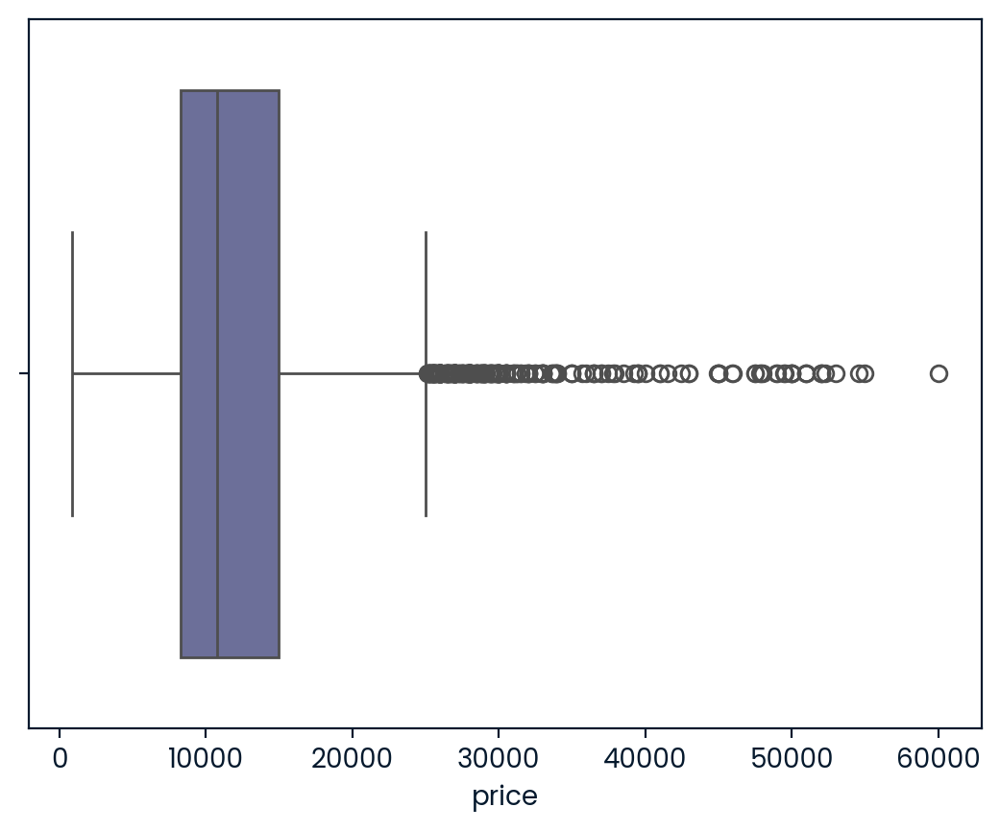
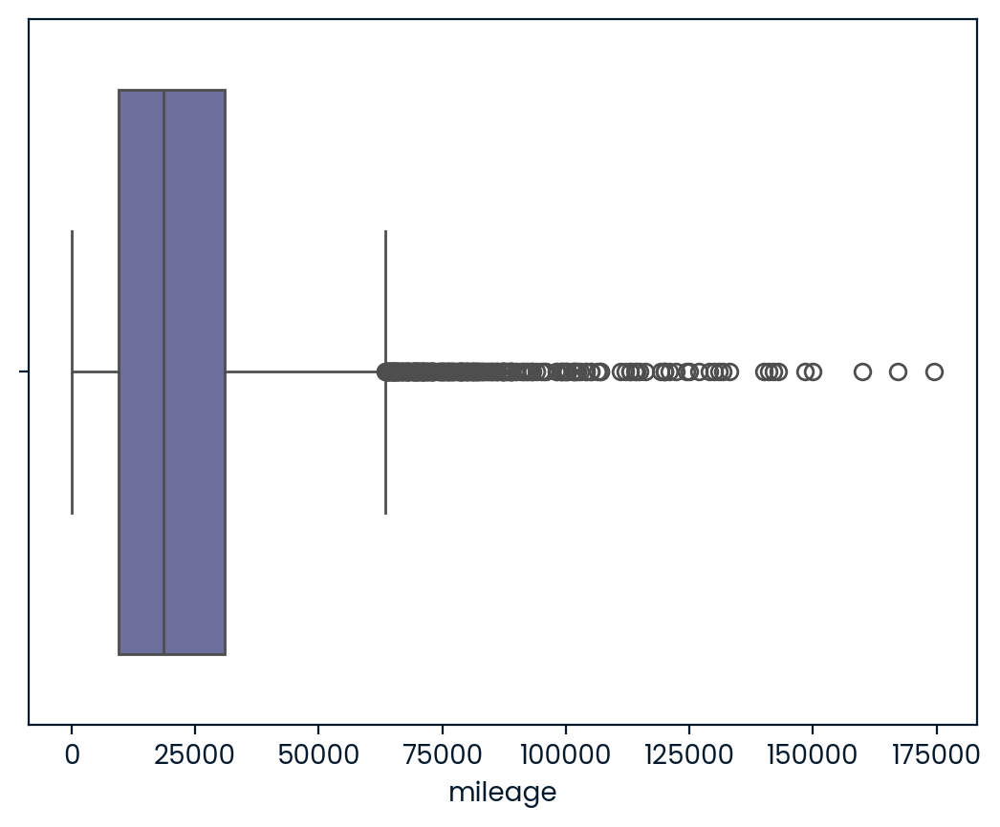
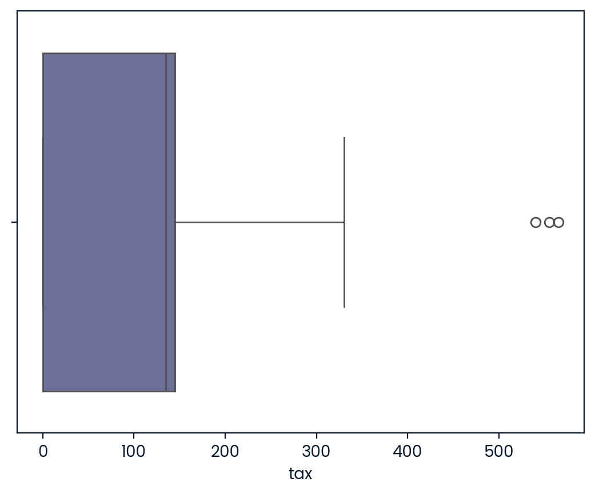
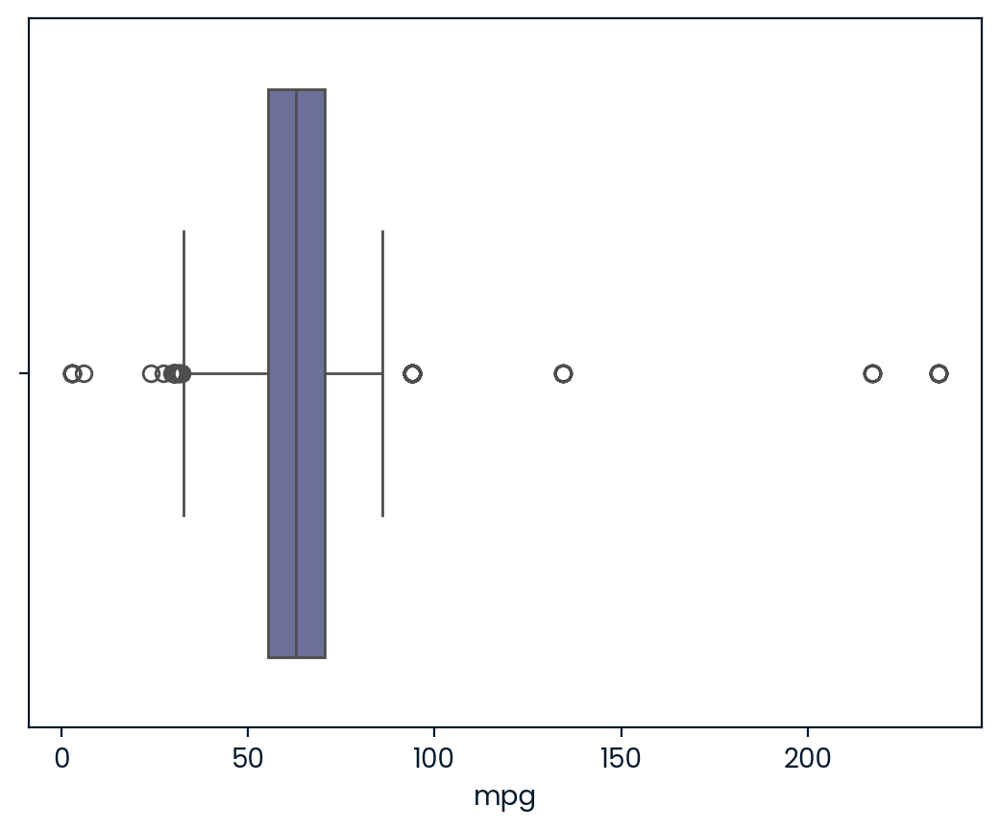
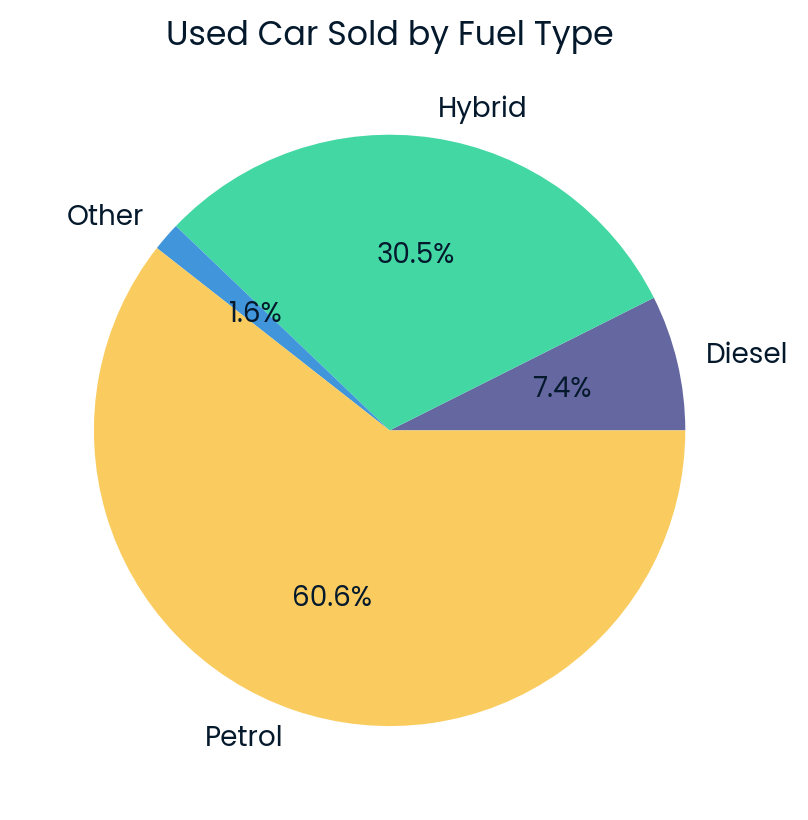
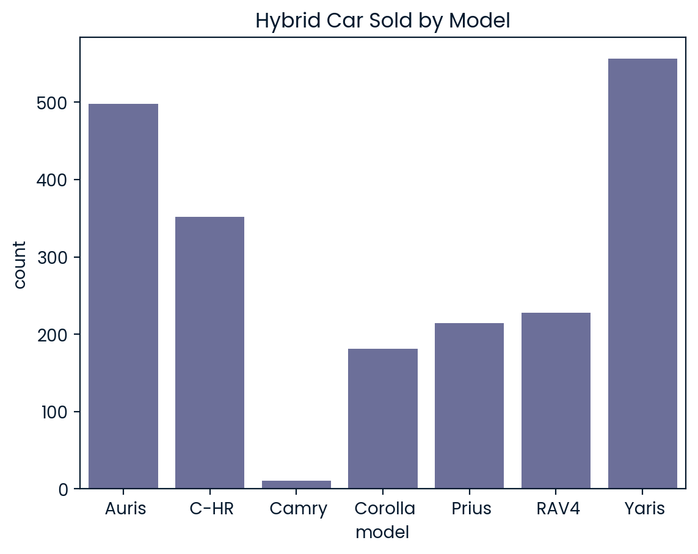
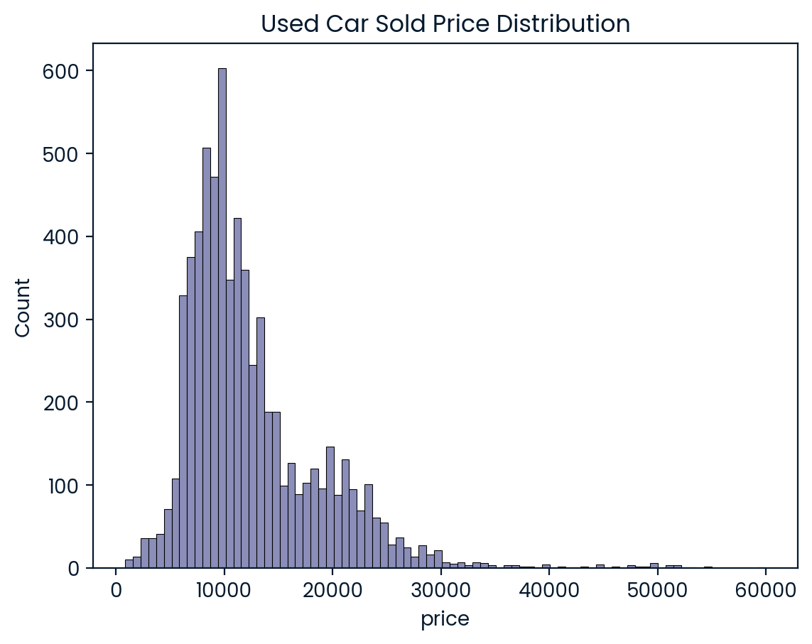
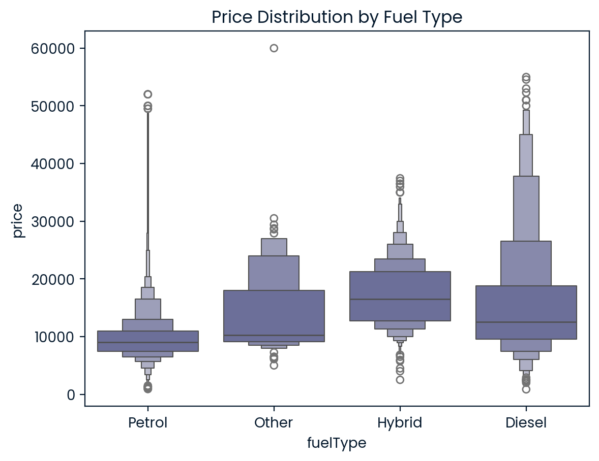
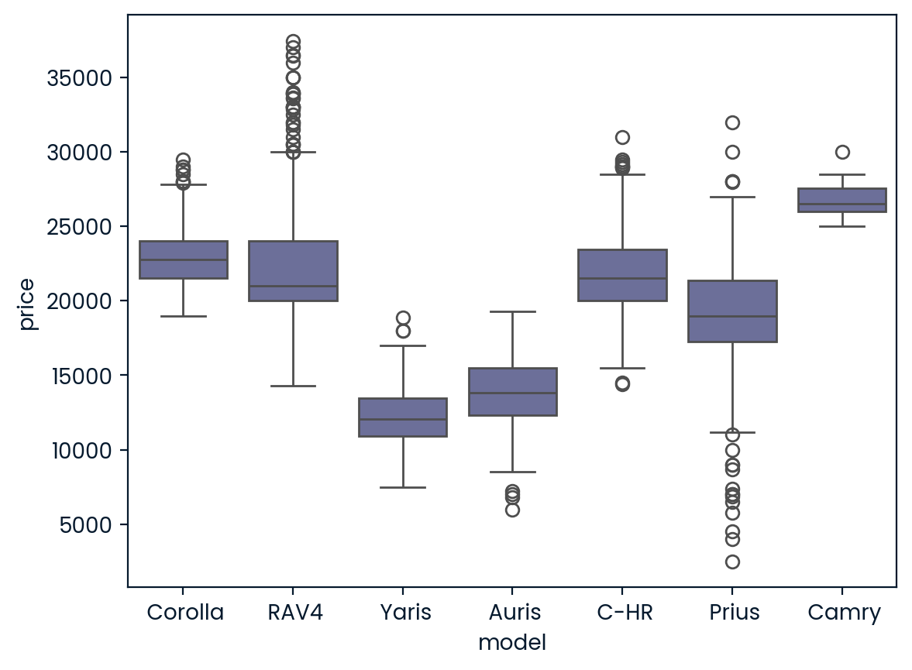
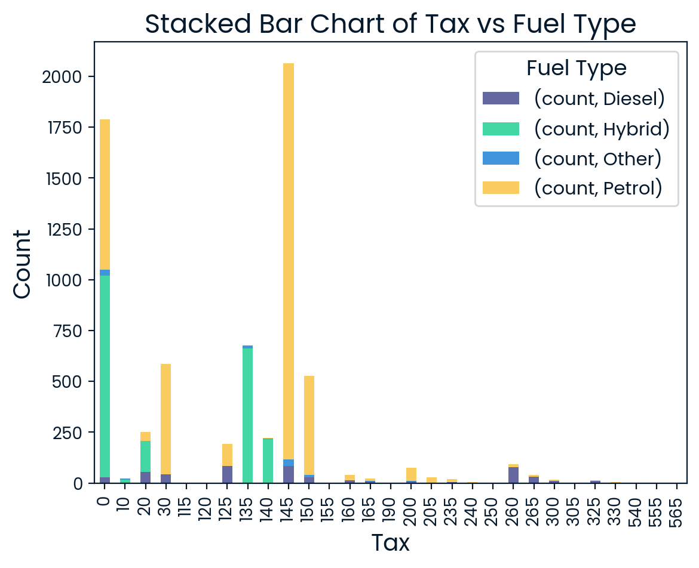

# Company Background

Discount Motors is a used car dealership in the UK. They want to lead the way in used cars. Selling to customers who want the latest and greatest features, without the price tag of a brand new car. The UK Government has now announced that from 2030 all new cars will be required to be zero emissions. Although this won’t impact the used car market, it is expected that buyers will give more consideration to the future value of their cars. And petrol and diesel will likely have a much lower value after 2030.

## UK Used Car Sales

The details in the data reflect the information given to potential buyers in the website adverts. Buyers typically want to know the road tax of a used car, which varies based on a combination of year registered, emissions and fuel type, with Electric cars currently exempt from road tax.

# Dataset

The marketing team has provided some data from the website listings from the last six months. We know that all of the cars in this data sold.

| Column Name  | Details                                                                                                       |
| ------------ | ------------------------------------------------------------------------------------------------------------- |
| model        | Character, the model of the car, 18 possible values                                                           |
| year         | Numeric, year of registration from 1998 to 2020                                                               |
| price        | Numeric, listed value of the car in GBP. Assume the car also sold for this price.                             |
| transmission | Character, one of "Manual", "Automatic", "Semi-Auto" or "Other"                                               |
| mileage      | Numeric, listed mileage of the car at time of sale                                                            |
| fuelType     | Character, one of "Petrol", "Hybrid", "Diesel" or "Other"                                                     |
| tax          | Numeric, road tax in GBP. Calculated based on CO2 emissions or a fixed price depending on the age of the car. |
| mpg          | Numeric, miles per gallon as reported by manufacturer                                                         |
| engineSize   | Numeric, listed engine size, one of 16 possible values                                                        |

# 1.Data Loading

```python
-- Explore the data in the table
SELECT *
FROM 'toyota.csv'

```

<div>
<style scoped>
    .dataframe tbody tr th:only-of-type {
        vertical-align: middle;
    }

    .dataframe tbody tr th {
        vertical-align: top;
    }

    .dataframe thead th {
        text-align: right;
    }

</style>
<table border="1" class="dataframe">
  <thead>
    <tr style="text-align: right;">
      <th></th>
      <th>model</th>
      <th>year</th>
      <th>price</th>
      <th>transmission</th>
      <th>mileage</th>
      <th>fuelType</th>
      <th>tax</th>
      <th>mpg</th>
      <th>engineSize</th>
    </tr>
  </thead>
  <tbody>
    <tr>
      <th>0</th>
      <td>GT86</td>
      <td>2016</td>
      <td>16000</td>
      <td>Manual</td>
      <td>24089</td>
      <td>Petrol</td>
      <td>265</td>
      <td>36.2</td>
      <td>2.0</td>
    </tr>
    <tr>
      <th>1</th>
      <td>GT86</td>
      <td>2017</td>
      <td>15995</td>
      <td>Manual</td>
      <td>18615</td>
      <td>Petrol</td>
      <td>145</td>
      <td>36.2</td>
      <td>2.0</td>
    </tr>
    <tr>
      <th>2</th>
      <td>GT86</td>
      <td>2015</td>
      <td>13998</td>
      <td>Manual</td>
      <td>27469</td>
      <td>Petrol</td>
      <td>265</td>
      <td>36.2</td>
      <td>2.0</td>
    </tr>
    <tr>
      <th>3</th>
      <td>GT86</td>
      <td>2017</td>
      <td>18998</td>
      <td>Manual</td>
      <td>14736</td>
      <td>Petrol</td>
      <td>150</td>
      <td>36.2</td>
      <td>2.0</td>
    </tr>
    <tr>
      <th>4</th>
      <td>GT86</td>
      <td>2017</td>
      <td>17498</td>
      <td>Manual</td>
      <td>36284</td>
      <td>Petrol</td>
      <td>145</td>
      <td>36.2</td>
      <td>2.0</td>
    </tr>
    <tr>
      <th>...</th>
      <td>...</td>
      <td>...</td>
      <td>...</td>
      <td>...</td>
      <td>...</td>
      <td>...</td>
      <td>...</td>
      <td>...</td>
      <td>...</td>
    </tr>
    <tr>
      <th>6733</th>
      <td>IQ</td>
      <td>2011</td>
      <td>5500</td>
      <td>Automatic</td>
      <td>30000</td>
      <td>Petrol</td>
      <td>20</td>
      <td>58.9</td>
      <td>1.0</td>
    </tr>
    <tr>
      <th>6734</th>
      <td>Urban Cruiser</td>
      <td>2011</td>
      <td>4985</td>
      <td>Manual</td>
      <td>36154</td>
      <td>Petrol</td>
      <td>125</td>
      <td>50.4</td>
      <td>1.3</td>
    </tr>
    <tr>
      <th>6735</th>
      <td>Urban Cruiser</td>
      <td>2012</td>
      <td>4995</td>
      <td>Manual</td>
      <td>46000</td>
      <td>Diesel</td>
      <td>125</td>
      <td>57.6</td>
      <td>1.4</td>
    </tr>
    <tr>
      <th>6736</th>
      <td>Urban Cruiser</td>
      <td>2011</td>
      <td>3995</td>
      <td>Manual</td>
      <td>60700</td>
      <td>Petrol</td>
      <td>125</td>
      <td>50.4</td>
      <td>1.3</td>
    </tr>
    <tr>
      <th>6737</th>
      <td>Urban Cruiser</td>
      <td>2011</td>
      <td>4495</td>
      <td>Manual</td>
      <td>45128</td>
      <td>Petrol</td>
      <td>125</td>
      <td>50.4</td>
      <td>1.3</td>
    </tr>
  </tbody>
</table>
<p>6738 rows × 9 columns</p>
</div>

```python
import numpy as np
import pandas as pd
import matplotlib.pyplot as plt
import seaborn as sns
```

# 2. Data Validation

## 2.1 explore data size

```python
print(f"the dataset has {df.shape[0]} rows and {df.shape[1]} columns")
```

    the dataset has 6738 rows and 9 columns

## 2.2 remove duplicates

```python
duplicate_counts=df[df.duplicated()].shape[0]
duplicate_counts
```

    39

```python
df.drop_duplicates(inplace=True)
```

## 2.3 handle missing values

```python
df.isnull().any()
```

    model           False
    year            False
    price           False
    transmission    False
    mileage         False
    fuelType        False
    tax             False
    mpg             False
    engineSize      False
    dtype: bool

no missing values are found

## 2.4 transfrom datatype

```python
df.info()
```

    <class 'pandas.core.frame.DataFrame'>
    Index: 6699 entries, 0 to 6737
    Data columns (total 9 columns):
     #   Column        Non-Null Count  Dtype
    ---  ------        --------------  -----
     0   model         6699 non-null   object
     1   year          6699 non-null   int64
     2   price         6699 non-null   int64
     3   transmission  6699 non-null   object
     4   mileage       6699 non-null   int64
     5   fuelType      6699 non-null   object
     6   tax           6699 non-null   int64
     7   mpg           6699 non-null   float64
     8   engineSize    6699 non-null   float64
    dtypes: float64(2), int64(4), object(3)
    memory usage: 523.4+ KB

the datatype in each column is aligned with the description

## 2.4 check data consistency

```python
df['model'].value_counts()
```

    model
    Yaris            2117
    Aygo             1940
    Auris             709
    C-HR              479
    RAV4              467
    Corolla           265
    Prius             232
    Verso             114
    Avensis           114
    Hilux              85
    GT86               73
    Land Cruiser       51
    PROACE VERSO       15
    Supra              12
    Camry              11
    IQ                  8
    Urban Cruiser       4
    Verso-S             3
    Name: count, dtype: int64

```python
df['year'].value_counts().sort_index()
```

    year
    1998       1
    1999       1
    2000       1
    2001       1
    2002       4
    2003       6
    2004       7
    2005      12
    2006      11
    2007      20
    2008      19
    2009      29
    2010      18
    2011      40
    2012      42
    2013     203
    2014     351
    2015     522
    2016     990
    2017    2015
    2018    1014
    2019    1265
    2020     127
    Name: count, dtype: int64

```python
df['transmission'].value_counts()
```

    transmission
    Manual       3793
    Automatic    2651
    Semi-Auto     254
    Other           1
    Name: count, dtype: int64

```python
df['fuelType'].value_counts()
```

    fuelType
    Petrol    4058
    Hybrid    2040
    Diesel     496
    Other      105
    Name: count, dtype: int64

```python
df['engineSize'].value_counts()
```

    engineSize
    1.0    2038
    1.5    1419
    1.8    1289
    1.3     600
    2.0     394
    1.2     300
    2.5     247
    1.6     166
    2.4      70
    2.2      58
    1.4      40
    2.8      36
    3.0      34
    0.0       6
    4.2       1
    4.5       1
    Name: count, dtype: int64

the data is consistent with the description

## 2.5 handle outliers

```python
sns.boxplot(data=df,x='price')
plt.show()
```



The box is relatively narrow, indicating that the central part of the data is concentrated within a relatively small range (i.e., most of the data's price values are low).

A large number of outliers: The boxplot shows many outliers scattered between 20,000 and 60,000, meaning that there are some vehicles with prices significantly higher than the rest, possibly due to special cases (such as luxury cars or new cars) causing price anomalies.

Right-skewed distribution: The data shows a certain degree of right skew (a longer tail), meaning that there are some extreme values in the higher price range, but most of the data is concentrated in the lower price region.

Therefore, we need to further analyze the high price records to see whether they are normal records.

```python
high_price=df[df['price']>25000]
high_price.groupby(['model','year']).size()

```

    model         year
    C-HR          2019    41
                  2020     9
    Camry         2019     9
                  2020     1
    Corolla       2019    11
                  2020    20
    GT86          2019     9
                  2020     8
    Hilux         2016     1
                  2018     2
                  2019     9
                  2020     3
    Land Cruiser  2013     1
                  2014     3
                  2015     6
                  2016     2
                  2017     7
                  2018     1
                  2019    15
                  2020     8
    PROACE VERSO  2019     9
                  2020     2
    Prius         2019     9
                  2020     5
    RAV4          2018     4
                  2019    46
                  2020     4
    Supra         2019    12
    Yaris         2018     1
    dtype: int64

It is clear that the majority of high-priced cars are either new or high-end models.

```python
sns.boxplot(data=df,x='mileage')


```

    <Axes: xlabel='mileage'>



The box is relatively narrow, indicating that the central part of the data is concentrated within a relatively small range (i.e., most of the data's mileage values are low).

A large number of outliers: The boxplot shows many outliers scattered between 60,000 and 175,000, meaning that there are some vehicles with mileage significantly higher than the rest, possibly due to special cases (such as old cars).

Therefore, we need further analysis.

```python
high_mile=df[df['mileage']>60000]
high_mile_group=high_mile.groupby(['year','mileage']).size().reset_index(name='count')
high_mile_group.sort_values('mileage',ascending=False)
```

<div>
<style scoped>
    .dataframe tbody tr th:only-of-type {
        vertical-align: middle;
    }

    .dataframe tbody tr th {
        vertical-align: top;
    }

    .dataframe thead th {
        text-align: right;
    }

</style>
<table border="1" class="dataframe">
  <thead>
    <tr style="text-align: right;">
      <th></th>
      <th>year</th>
      <th>mileage</th>
      <th>count</th>
    </tr>
  </thead>
  <tbody>
    <tr>
      <th>67</th>
      <td>2008</td>
      <td>174419</td>
      <td>1</td>
    </tr>
    <tr>
      <th>11</th>
      <td>2003</td>
      <td>167054</td>
      <td>1</td>
    </tr>
    <tr>
      <th>16</th>
      <td>2004</td>
      <td>160000</td>
      <td>1</td>
    </tr>
    <tr>
      <th>116</th>
      <td>2011</td>
      <td>150000</td>
      <td>1</td>
    </tr>
    <tr>
      <th>84</th>
      <td>2009</td>
      <td>148371</td>
      <td>1</td>
    </tr>
    <tr>
      <th>...</th>
      <td>...</td>
      <td>...</td>
      <td>...</td>
    </tr>
    <tr>
      <th>218</th>
      <td>2015</td>
      <td>60148</td>
      <td>1</td>
    </tr>
    <tr>
      <th>117</th>
      <td>2012</td>
      <td>60069</td>
      <td>1</td>
    </tr>
    <tr>
      <th>171</th>
      <td>2014</td>
      <td>60067</td>
      <td>1</td>
    </tr>
    <tr>
      <th>134</th>
      <td>2013</td>
      <td>60020</td>
      <td>1</td>
    </tr>
    <tr>
      <th>254</th>
      <td>2016</td>
      <td>60017</td>
      <td>1</td>
    </tr>
  </tbody>
</table>
<p>316 rows × 3 columns</p>
</div>

```python
sns.boxplot(data=df,x='tax')

```

    <Axes: xlabel='tax'>



Most high mileage values are due to the cars being old.

```python
sns.boxplot(data=df,x='mpg')

```

    <Axes: xlabel='mpg'>



there are few records with significantly low and high mpg values, which requires further analysis.

```python
low_mpg=df[df['mpg']<25]
high_mpg=df[df['mpg']>100]
```

```python
low_mpg[['year','model','fuelType']].value_counts()
```

    year  model         fuelType
    2019  Hilux         Diesel      5
    2020  Hilux         Diesel      5
    1998  Land Cruiser  Diesel      1
    2018  C-HR          Petrol      1
    Name: count, dtype: int64

he low MPG of the Hilux and Land Cruiser is mainly due to their vehicle types (pickup trucks, off-road SUVs), larger engine sizes, higher weight, and poor aerodynamic performance. The low MPG of the C-HR may be related to its larger size as an SUV and higher air resistance.

```python
high_mpg[['year','model','fuelType']].value_counts()
```

    year  model  fuelType
    2019  Prius  Hybrid      7
    2018  Prius  Hybrid      5
    2017  Prius  Hybrid      3
    2019  Prius  Other       3
    2013  Prius  Hybrid      2
    2014  Prius  Hybrid      2
    2015  Prius  Hybrid      2
    2020  Prius  Hybrid      2
    2012  Prius  Hybrid      1
    2014  Prius  Other       1
    2016  Prius  Other       1
    2018  Prius  Other       1
    Name: count, dtype: int64

The high MPG of the Prius is due to the combination of its hybrid powertrain, regenerative braking, aerodynamic design, and efficient engine technology. These factors make it one of the most fuel-efficient vehicles on the market.

# 3.Exploratory Analysis

## single-variable analysis

### used car sold by fuel type

```python
fuel_type_sales=df.groupby('fuelType').size().reset_index(name='count')
plt.pie(data=fuel_type_sales,x='count',autopct='%1.1f%%',labels='fuelType')
plt.title('Used Car Sold by Fuel Type')
plt.show()
```



The chart shows that in the dataset, petrol cars make up the majority, hybrid cars account for a certain proportion, while diesel cars and other types are less common.

### hybrid car sold by model

```python
hybrid=df[df['fuelType']=='Hybrid'].groupby('model').size().reset_index(name='count')
sns.barplot(data=hybrid,x='model',y='count')
plt.title('Hybrid Car Sold by Model')
plt.show()
```



the best sellers of hybrid cars are Yaris,followed by Auris and C-HR.

### used car sold price distribution

```python
sns.histplot(data=df,x='price')
plt.title('Used Car Sold Price Distribution')
plt.show()
```



We also want to compare the price of all the cars we sold last 6 months. The majority of used cars sold last 6 months is less than 30000 GBP.

### price distribution by fuel type

```python
sns.boxenplot(data=df,x='fuelType',y='price')
plt.title('Price Distribution by Fuel Type')
plt.show()
```



The majority of the price of a hybrid car range from 11000 to 21000 GBP, which is higher than petrol and diesel.

Petrol cars, the largest rival of the hybrid cars, majorly sold from 9000 to 12000 GBP. But as you can see from this graph, a few hybrid cars are also sold in this range.

### price distribution by model (hybrid cars only)

```python
hybrid_price=df[df['fuelType']=='Hybrid']
sns.boxplot(data=hybrid_price,x='model',y='price')
plt.show()
```



# How to Make the Hybrid more Attractive?

Since the Hybrid models are more expensive than other types on average, we will find different ways to attract customers. From the multiple boxplots below, Prius, Yaris and Auris have records of selling lower than 10000 GBP in the last 6 months, which is competitive with the petrol cars. Therefore, for people concerned about price, we should make these three models our major campaign car models.

### tax distribution by fuel type

```python
tax_fuel=df.groupby(['tax','fuelType']).size().reset_index(name='count')
tax_fuel_pivot=pd.pivot_table(data=tax_fuel,index='tax',columns='fuelType')
tax_fuel_pivot.plot(kind='bar',stacked=True)
plt.title('Stacked Bar Chart of Tax vs Fuel Type', fontsize=16)
plt.xlabel('Tax', fontsize=14)
plt.ylabel('Count', fontsize=14)
plt.legend(title='Fuel Type', title_fontsize='13', fontsize='11')
plt.show()
```



The other attractive information is the tax. From the bar chart above, we can see the most common road tax for the petrol model is 145 GBP, while the most common road tax for the hybrid model is 0 GBP. Therefore, for people buying traditional fuel-type car models, a Hybrid might be an excellent choice based on this information.

# Business Metrics

Since our goal is to increase the number of sales of hybrid and electric cars next year, I would recommend we use the percentage of hybrid and electric cars in total number of used cars sold last 6 months as our metric.

Based on our last 6 month data, 30% of the used cars sold are hybrid and electric cars. Therefore, if this number is increasing next 6 month, it indicates very good sign to achieve our goal.

# Recommendation

For the following weeks, I would recommend we can focus on the following steps:

- Using key metrics to monitor whether there is a strong sign to see the sales will increase.
- To implement the campaign as soon as possible, we should smartly promote the hybrid models in the market:
  - Promoting road tax reduction
  - Less expensive models -Prius, Yaris and Auris model
  - Stay on top of the current electric and hybrid car markets so that the newest information can be integrated in the campaign.
- Data Collection for in-depth analysis
  - Improve data quality - what the other fuel type means?
  - New related data - Using different fuel types in the same car model to compare eco-friendly cars and other fuel types
